# Leader Election と子プロセス管理

> **対象読者**: Leader Election の基本を理解しており、リーダー Pod
> のみが子プロセスを管理するシステムを構築したいエンジニア

## 📚 目次

1. [概要](#1-概要)
2. [アーキテクチャ設計](#2-アーキテクチャ設計)
3. [子プロセスのライフサイクル管理](#3-子プロセスのライフサイクル管理)
4. [実装パターン](#4-実装パターン)
5. [gRPC Stream との連携](#5-grpc-stream-との連携)
6. [エラーハンドリングと回復戦略](#6-エラーハンドリングと回復戦略)
7. [実装例](#7-実装例)

---

## 1. 概要

### 1.1 解決したい課題

リーダー Pod
のみが子プロセスを起動・管理するシステムでは、以下の課題を解決する必要があります：

| 課題                                 | 説明                                                                        |
| ------------------------------------ | --------------------------------------------------------------------------- |
| **リーダーシップ喪失時の安全な終了** | 子プロセスが gRPC Stream で通信中の場合、接続を適切にクローズする必要がある |
| **リーダー昇格時の正常な起動**       | 新しいリーダーが子プロセスを確実に起動し、通信を確立する必要がある          |
| **状態の一貫性**                     | リーダー交代時に、子プロセスの状態が破損しないようにする                    |

### 1.2 システム構成

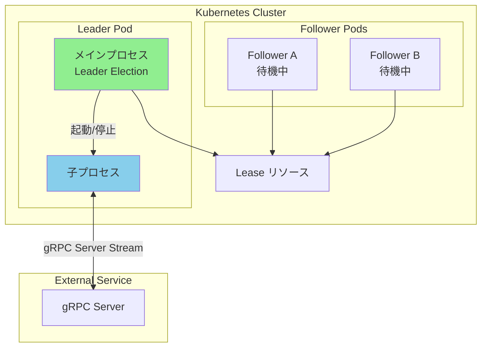

---

## 2. アーキテクチャ設計

### 2.1 状態遷移図

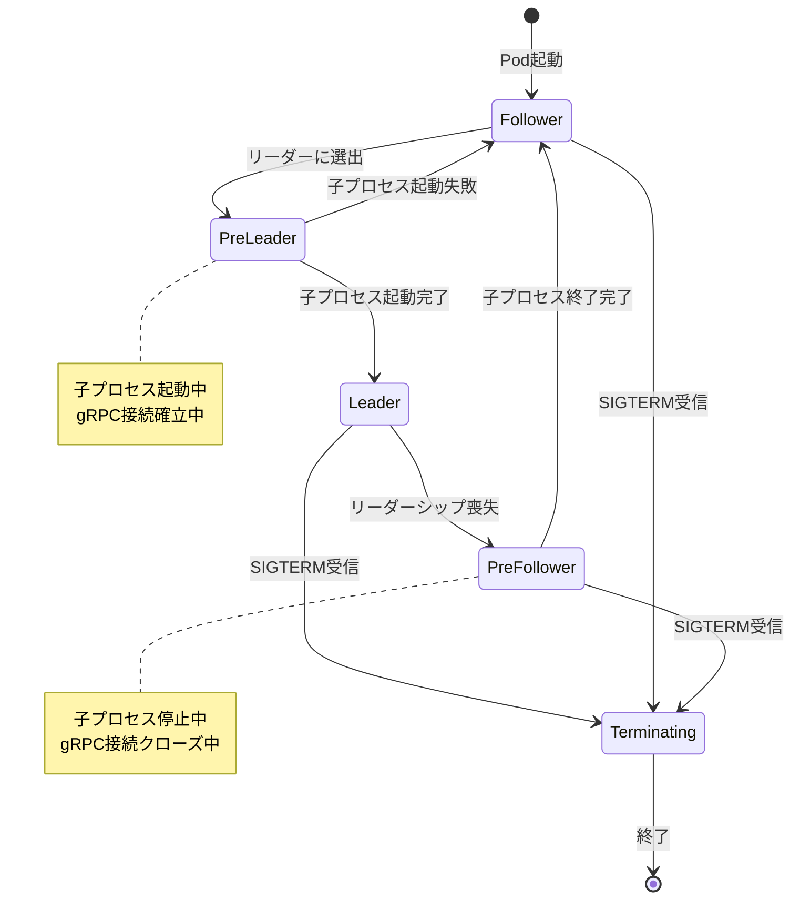

### 2.2 コンポーネント図

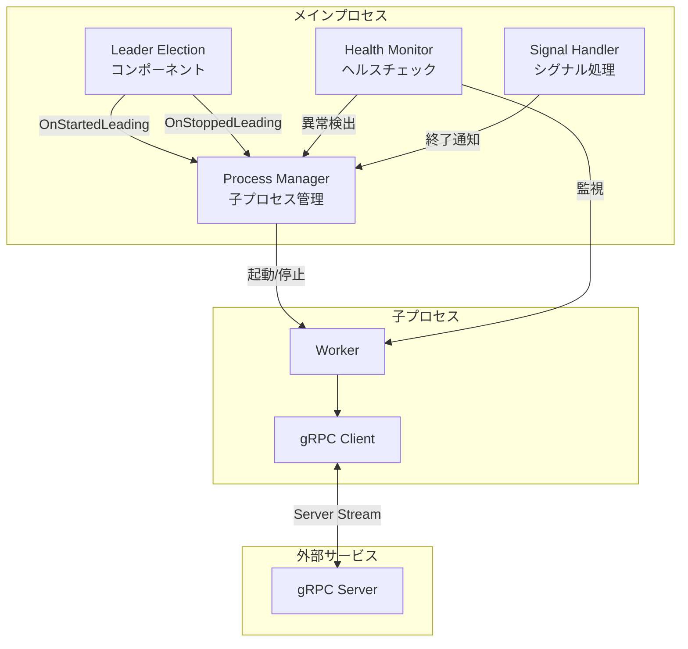

### 2.3 設計原則

| 原則                       | 説明                                               |
| -------------------------- | -------------------------------------------------- |
| **Graceful Shutdown 優先** | 子プロセスの終了は必ず gRPC 接続のクローズを待つ   |
| **タイムアウト付き終了**   | 無限に待たないよう、終了処理にはタイムアウトを設定 |
| **状態の明確化**           | 各フェーズ（起動中、実行中、停止中）を明確に区別   |
| **べき等性**               | 複数回の起動/停止要求に対して安全に動作            |

---

## 3. 子プロセスのライフサイクル管理

### 3.1 ライフサイクルフェーズ

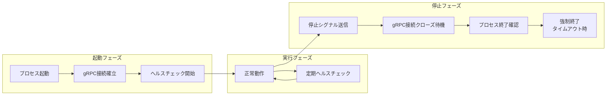

### 3.2 停止シーケンス（詳細）

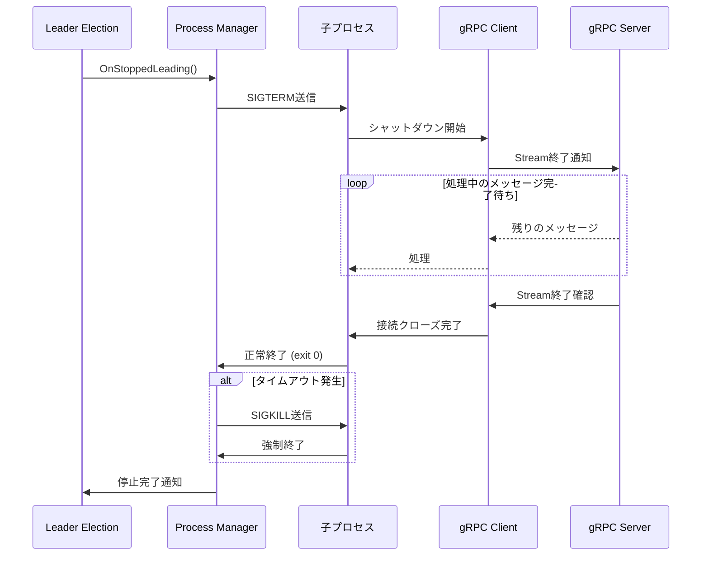

### 3.3 起動シーケンス（詳細）

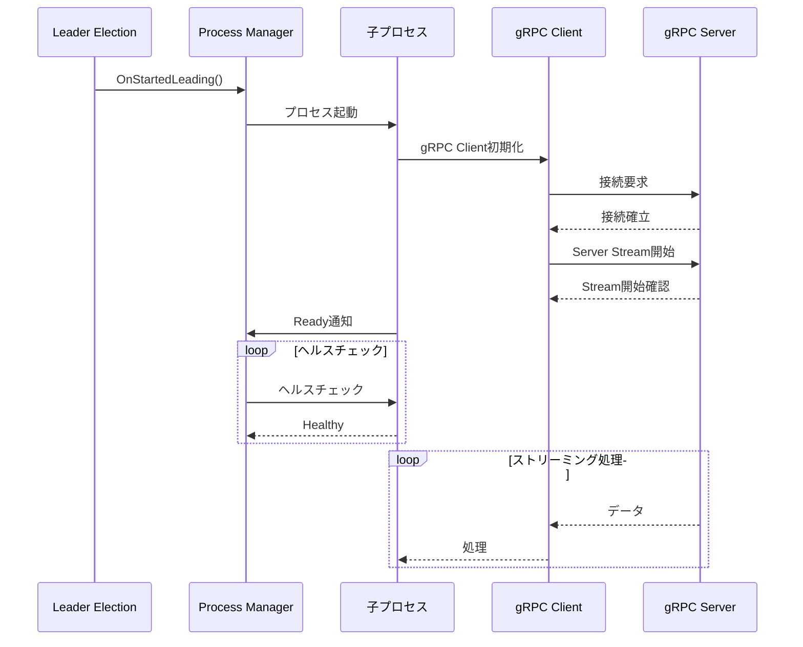

---

## 4. 実装パターン

### 4.1 Process Manager インターフェース

```go
// ProcessManager は子プロセスのライフサイクルを管理します
type ProcessManager interface {
    // Start は子プロセスを起動します
    // ctx がキャンセルされると起動処理を中断します
    Start(ctx context.Context) error
    
    // Stop は子プロセスを安全に停止します
    // timeout 時間内に終了しない場合は強制終了します
    Stop(timeout time.Duration) error
    
    // IsRunning は子プロセスが実行中かどうかを返します
    IsRunning() bool
    
    // Wait は子プロセスの終了を待機します
    Wait() error
}
```

### 4.2 状態管理パターン

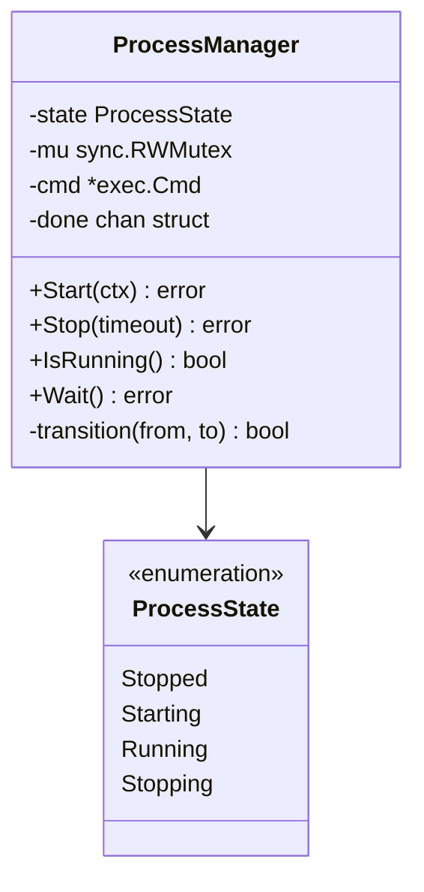

### 4.3 Context の伝搬パターン

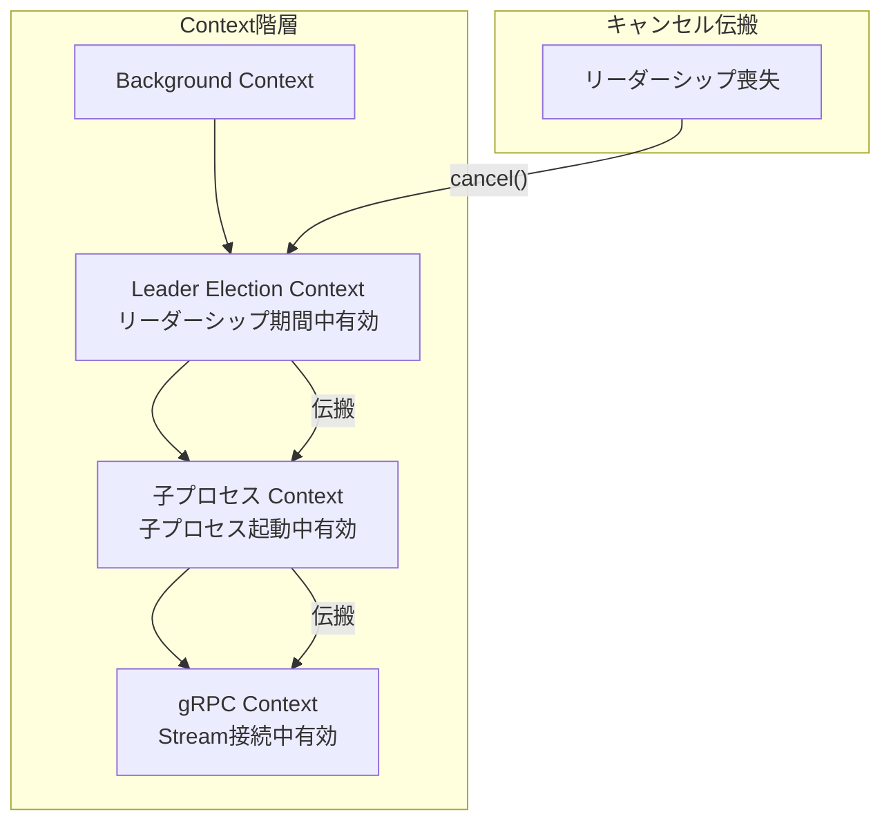

---

## 5. gRPC Stream との連携

### 5.1 Server Stream の安全な終了

gRPC Server Stream を使用する場合、以下の点に注意が必要です：

| 注意点               | 対策                                     |
| -------------------- | ---------------------------------------- |
| 処理中のメッセージ   | 受信中のメッセージは処理完了まで待つ     |
| 接続のクリーンアップ | `CloseSend()` を呼び出して明示的に終了   |
| サーバー側の状態     | サーバーが接続終了を認識できるようにする |

### 5.2 gRPC Client の実装パターン

```go
// StreamClient は gRPC Server Stream を管理します
type StreamClient struct {
    conn   *grpc.ClientConn
    stream pb.Service_StreamClient
    done   chan struct{}
    mu     sync.Mutex
}

// Start はストリームを開始します
func (c *StreamClient) Start(ctx context.Context) error {
    // 接続確立とストリーム開始
}

// Shutdown は安全にストリームを終了します
func (c *StreamClient) Shutdown(ctx context.Context) error {
    c.mu.Lock()
    defer c.mu.Unlock()
    
    // 1. 新規リクエストの受付停止
    // 2. 処理中のメッセージ完了待ち
    // 3. ストリームのクローズ
    // 4. 接続のクローズ
}
```

### 5.3 終了処理のタイムライン

```mermaid
gantt
    title 子プロセス終了処理のタイムライン
    dateFormat ss
    axisFormat %S秒
    
    section 正常終了
    SIGTERM受信           :a1, 00, 1s
    新規リクエスト停止    :a2, after a1, 1s
    処理中メッセージ完了  :a3, after a2, 3s
    gRPC接続クローズ      :a4, after a3, 1s
    プロセス終了          :a5, after a4, 1s
    
    section タイムアウト
    Grace Period          :crit, b1, 00, 10s
    SIGKILL送信           :crit, b2, after b1, 1s
```

---

## 6. エラーハンドリングと回復戦略

### 6.1 障害シナリオ

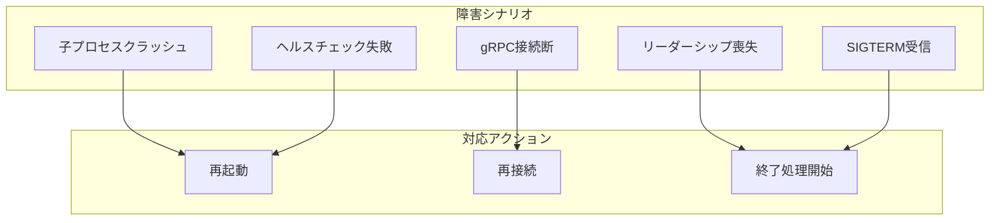

### 6.2 リーダー不健全時の安全な終了

リーダー Pod が不健全な状態になった場合の終了フローです：

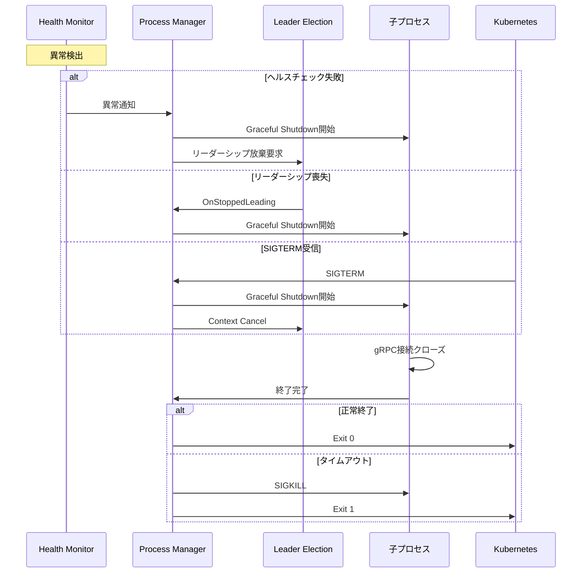

### 6.3 回復戦略マトリクス

| 障害種別             | 検出方法                        | 回復アクション               | タイムアウト |
| -------------------- | ------------------------------- | ---------------------------- | ------------ |
| 子プロセスクラッシュ | `Wait()` からの返却             | 自動再起動（リーダーの場合） | 即時         |
| gRPC 接続断          | Stream エラー                   | 再接続（指数バックオフ）     | 30秒         |
| ヘルスチェック失敗   | 定期チェック                    | 終了して再起動               | 3回連続失敗  |
| リーダーシップ喪失   | `OnStoppedLeading` コールバック | Graceful Shutdown            | 30秒         |
| Pod 終了             | SIGTERM                         | Graceful Shutdown            | 30秒         |

### 6.4 再接続の指数バックオフ

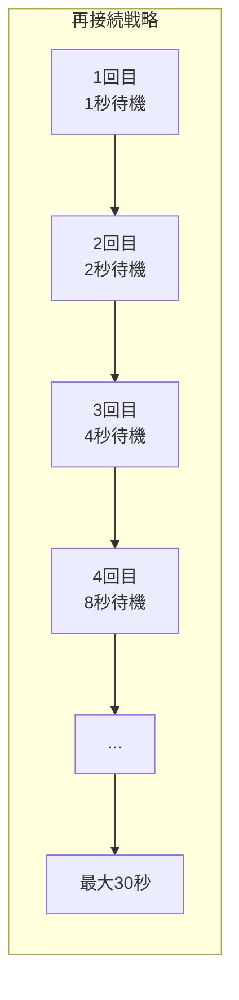

---

## 7. 実装例

### 7.1 完全な実装例

```go
package main

import (
    "context"
    "log"
    "os"
    "os/exec"
    "os/signal"
    "sync"
    "syscall"
    "time"

    metav1 "k8s.io/apimachinery/pkg/apis/meta/v1"
    "k8s.io/client-go/kubernetes"
    "k8s.io/client-go/rest"
    "k8s.io/client-go/tools/leaderelection"
    "k8s.io/client-go/tools/leaderelection/resourcelock"
)

// ProcessState はプロセスの状態を表します
type ProcessState int

const (
    StateStopped ProcessState = iota
    StateStarting
    StateRunning
    StateStopping
)

func (s ProcessState) String() string {
    switch s {
    case StateStopped:
        return "Stopped"
    case StateStarting:
        return "Starting"
    case StateRunning:
        return "Running"
    case StateStopping:
        return "Stopping"
    default:
        return "Unknown"
    }
}

// ChildProcessManager は子プロセスのライフサイクルを管理します
type ChildProcessManager struct {
    command string
    args    []string

    mu       sync.RWMutex
    state    ProcessState
    cmd      *exec.Cmd
    doneChan chan struct{}
}

// NewChildProcessManager は新しい ChildProcessManager を作成します
func NewChildProcessManager(command string, args ...string) *ChildProcessManager {
    return &ChildProcessManager{
        command: command,
        args:    args,
        state:   StateStopped,
    }
}

// Start は子プロセスを起動します
func (m *ChildProcessManager) Start(ctx context.Context) error {
    m.mu.Lock()
    
    // 既に起動中または実行中の場合は何もしない
    if m.state == StateStarting || m.state == StateRunning {
        m.mu.Unlock()
        return nil
    }
    
    m.state = StateStarting
    m.doneChan = make(chan struct{})
    m.mu.Unlock()
    
    log.Printf("[ProcessManager] Starting child process: %s %v", m.command, m.args)
    
    // 子プロセスの作成
    m.cmd = exec.CommandContext(ctx, m.command, m.args...)
    m.cmd.Stdout = os.Stdout
    m.cmd.Stderr = os.Stderr
    
    // プロセスグループを設定（子プロセスと孫プロセスをまとめて管理）
    m.cmd.SysProcAttr = &syscall.SysProcAttr{
        Setpgid: true,
    }
    
    if err := m.cmd.Start(); err != nil {
        m.mu.Lock()
        m.state = StateStopped
        m.mu.Unlock()
        return err
    }
    
    m.mu.Lock()
    m.state = StateRunning
    m.mu.Unlock()
    
    log.Printf("[ProcessManager] Child process started with PID: %d", m.cmd.Process.Pid)
    
    // プロセスの終了を監視
    go func() {
        err := m.cmd.Wait()
        
        m.mu.Lock()
        wasRunning := m.state == StateRunning
        m.state = StateStopped
        close(m.doneChan)
        m.mu.Unlock()
        
        if wasRunning {
            if err != nil {
                log.Printf("[ProcessManager] Child process exited with error: %v", err)
            } else {
                log.Printf("[ProcessManager] Child process exited normally")
            }
        }
    }()
    
    return nil
}

// Stop は子プロセスを安全に停止します
func (m *ChildProcessManager) Stop(timeout time.Duration) error {
    m.mu.Lock()
    
    // 既に停止中または停止済みの場合は何もしない
    if m.state == StateStopping || m.state == StateStopped {
        m.mu.Unlock()
        return nil
    }
    
    if m.state != StateRunning {
        m.mu.Unlock()
        return nil
    }
    
    m.state = StateStopping
    doneChan := m.doneChan
    cmd := m.cmd
    m.mu.Unlock()
    
    log.Printf("[ProcessManager] Stopping child process (timeout: %v)", timeout)
    
    // SIGTERM を送信（Graceful Shutdown の開始）
    if err := cmd.Process.Signal(syscall.SIGTERM); err != nil {
        log.Printf("[ProcessManager] Failed to send SIGTERM: %v", err)
    }
    
    // タイムアウト付きで終了を待機
    select {
    case <-doneChan:
        log.Printf("[ProcessManager] Child process stopped gracefully")
        return nil
    case <-time.After(timeout):
        log.Printf("[ProcessManager] Timeout waiting for graceful shutdown, sending SIGKILL")
        
        // プロセスグループ全体に SIGKILL を送信
        if err := syscall.Kill(-cmd.Process.Pid, syscall.SIGKILL); err != nil {
            log.Printf("[ProcessManager] Failed to send SIGKILL: %v", err)
        }
        
        <-doneChan
        return nil
    }
}

// IsRunning は子プロセスが実行中かどうかを返します
func (m *ChildProcessManager) IsRunning() bool {
    m.mu.RLock()
    defer m.mu.RUnlock()
    return m.state == StateRunning
}

// Wait は子プロセスの終了を待機します
func (m *ChildProcessManager) Wait() error {
    m.mu.RLock()
    doneChan := m.doneChan
    m.mu.RUnlock()
    
    if doneChan != nil {
        <-doneChan
    }
    return nil
}

func main() {
    podName := os.Getenv("POD_NAME")
    if podName == "" {
        log.Fatal("POD_NAME environment variable must be set")
    }

    namespace := os.Getenv("NAMESPACE")
    if namespace == "" {
        namespace = "leader-election-demo"
    }

    // Kubernetes クライアントの作成
    config, err := rest.InClusterConfig()
    if err != nil {
        log.Fatalf("Failed to get in-cluster config: %v", err)
    }

    clientset, err := kubernetes.NewForConfig(config)
    if err != nil {
        log.Fatalf("Failed to create clientset: %v", err)
    }

    // 子プロセスマネージャーの作成
    // 実際の使用では、子プロセスのコマンドと引数を適切に設定
    processManager := NewChildProcessManager(
        "/path/to/child-process",
        "--grpc-server", "grpc-server:50051",
    )

    // リソースロックの作成
    lock := &resourcelock.LeaseLock{
        LeaseMeta: metav1.ObjectMeta{
            Name:      "leader-election-lease",
            Namespace: namespace,
        },
        Client: clientset.CoordinationV1(),
        LockConfig: resourcelock.ResourceLockConfig{
            Identity: podName,
        },
    }

    // シグナルハンドリング用のコンテキスト
    ctx, cancel := context.WithCancel(context.Background())
    defer cancel()

    // SIGTERM と SIGINT をキャッチ
    signalChan := make(chan os.Signal, 1)
    signal.Notify(signalChan, syscall.SIGTERM, syscall.SIGINT)
    go func() {
        sig := <-signalChan
        log.Printf("[%s] Received signal %v, initiating shutdown...", podName, sig)
        
        // 子プロセスを先に停止
        if processManager.IsRunning() {
            log.Printf("[%s] Stopping child process before shutdown...", podName)
            if err := processManager.Stop(30 * time.Second); err != nil {
                log.Printf("[%s] Error stopping child process: %v", podName, err)
            }
        }
        
        cancel()
    }()

    // リーダー選出の実行
    leaderelection.RunOrDie(ctx, leaderelection.LeaderElectionConfig{
        Lock:            lock,
        ReleaseOnCancel: true,
        LeaseDuration:   15 * time.Second,
        RenewDeadline:   10 * time.Second,
        RetryPeriod:     2 * time.Second,
        Callbacks: leaderelection.LeaderCallbacks{
            OnStartedLeading: func(ctx context.Context) {
                log.Printf("[%s] >>> Became LEADER, starting child process <<<", podName)
                
                // リーダーになったら子プロセスを起動
                if err := processManager.Start(ctx); err != nil {
                    log.Printf("[%s] Failed to start child process: %v", podName, err)
                    // 子プロセスの起動に失敗した場合、リーダーシップを放棄すべきか検討
                    return
                }
                
                // 子プロセスの終了を監視
                // Context がキャンセルされるか、子プロセスが終了するまで待機
                <-ctx.Done()
                
                log.Printf("[%s] Leadership context cancelled, stopping child process...", podName)
            },
            OnStoppedLeading: func() {
                log.Printf("[%s] Lost leadership, ensuring child process is stopped", podName)
                
                // リーダーシップを失ったら子プロセスを停止
                if processManager.IsRunning() {
                    if err := processManager.Stop(30 * time.Second); err != nil {
                        log.Printf("[%s] Error stopping child process: %v", podName, err)
                    }
                }
            },
            OnNewLeader: func(identity string) {
                if identity == podName {
                    return
                }
                log.Printf("[%s] New leader elected: %s", podName, identity)
            },
        },
    })

    log.Printf("[%s] Leader election stopped", podName)
}
```

### 7.2 子プロセス側の実装例（gRPC Client）

子プロセス側では、SIGTERM を受け取ったときに gRPC
接続を適切にクローズする必要があります。

```go
package main

import (
    "context"
    "io"
    "log"
    "os"
    "os/signal"
    "sync"
    "syscall"
    "time"

    "google.golang.org/grpc"
    "google.golang.org/grpc/credentials/insecure"
    
    pb "your-project/proto" // 実際のプロトコルバッファパッケージに置き換え
)

// StreamProcessor は gRPC Server Stream を処理します
type StreamProcessor struct {
    serverAddr string
    conn       *grpc.ClientConn
    client     pb.YourServiceClient
    
    mu         sync.Mutex
    stream     pb.YourService_StreamClient
    processing bool
    done       chan struct{}
}

// NewStreamProcessor は新しい StreamProcessor を作成します
func NewStreamProcessor(serverAddr string) *StreamProcessor {
    return &StreamProcessor{
        serverAddr: serverAddr,
        done:       make(chan struct{}),
    }
}

// Connect は gRPC サーバーに接続します
func (p *StreamProcessor) Connect(ctx context.Context) error {
    var err error
    p.conn, err = grpc.DialContext(ctx, p.serverAddr,
        grpc.WithTransportCredentials(insecure.NewCredentials()),
        grpc.WithBlock(),
    )
    if err != nil {
        return err
    }
    
    p.client = pb.NewYourServiceClient(p.conn)
    log.Printf("[ChildProcess] Connected to gRPC server: %s", p.serverAddr)
    return nil
}

// StartStream は Server Stream を開始します
func (p *StreamProcessor) StartStream(ctx context.Context) error {
    var err error
    p.stream, err = p.client.YourStreamMethod(ctx, &pb.StreamRequest{})
    if err != nil {
        return err
    }
    
    p.processing = true
    log.Printf("[ChildProcess] Started gRPC Server Stream")
    
    // メッセージを受信して処理
    go func() {
        defer func() {
            p.mu.Lock()
            p.processing = false
            p.mu.Unlock()
            close(p.done)
        }()
        
        for {
            msg, err := p.stream.Recv()
            if err == io.EOF {
                log.Printf("[ChildProcess] Stream ended (EOF)")
                return
            }
            if err != nil {
                log.Printf("[ChildProcess] Stream error: %v", err)
                return
            }
            
            // メッセージを処理
            p.processMessage(msg)
        }
    }()
    
    return nil
}

func (p *StreamProcessor) processMessage(msg *pb.StreamResponse) {
    // 実際のメッセージ処理ロジック
    log.Printf("[ChildProcess] Processing message: %v", msg)
}

// Shutdown は安全にシャットダウンします
func (p *StreamProcessor) Shutdown(timeout time.Duration) error {
    log.Printf("[ChildProcess] Initiating shutdown...")
    
    p.mu.Lock()
    isProcessing := p.processing
    p.mu.Unlock()
    
    if !isProcessing {
        return p.closeConnection()
    }
    
    // 処理完了を待機
    select {
    case <-p.done:
        log.Printf("[ChildProcess] Stream processing completed")
    case <-time.After(timeout):
        log.Printf("[ChildProcess] Timeout waiting for stream completion")
    }
    
    return p.closeConnection()
}

func (p *StreamProcessor) closeConnection() error {
    if p.conn != nil {
        log.Printf("[ChildProcess] Closing gRPC connection")
        return p.conn.Close()
    }
    return nil
}

func main() {
    serverAddr := os.Getenv("GRPC_SERVER_ADDR")
    if serverAddr == "" {
        serverAddr = "localhost:50051"
    }
    
    processor := NewStreamProcessor(serverAddr)
    
    // メインコンテキスト
    ctx, cancel := context.WithCancel(context.Background())
    defer cancel()
    
    // gRPC サーバーに接続
    if err := processor.Connect(ctx); err != nil {
        log.Fatalf("[ChildProcess] Failed to connect: %v", err)
    }
    
    // Stream を開始
    if err := processor.StartStream(ctx); err != nil {
        log.Fatalf("[ChildProcess] Failed to start stream: %v", err)
    }
    
    // シグナルハンドリング
    signalChan := make(chan os.Signal, 1)
    signal.Notify(signalChan, syscall.SIGTERM, syscall.SIGINT)
    
    sig := <-signalChan
    log.Printf("[ChildProcess] Received signal: %v", sig)
    
    // Graceful Shutdown
    if err := processor.Shutdown(25 * time.Second); err != nil {
        log.Printf("[ChildProcess] Shutdown error: %v", err)
    }
    
    log.Printf("[ChildProcess] Shutdown complete")
}
```

### 7.3 タイムアウト設計のベストプラクティス

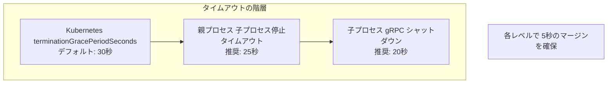

| レイヤー   | タイムアウト | 説明                            |
| ---------- | ------------ | ------------------------------- |
| Kubernetes | 30秒         | `terminationGracePeriodSeconds` |
| 親プロセス | 25秒         | 子プロセス停止 + マージン       |
| 子プロセス | 20秒         | gRPC シャットダウン + 処理完了  |
| gRPC 接続  | 15秒         | 処理中メッセージの完了待ち      |

---

## 📝 まとめ

リーダー Pod と子プロセスの管理を組み合わせる際の重要なポイント：

1. **状態管理の明確化**: 起動中、実行中、停止中の各フェーズを明確に区別
2. **Graceful Shutdown の実装**: gRPC 接続を適切にクローズしてから終了
3. **タイムアウトの階層設計**: 各レイヤーで適切なタイムアウトを設定
4. **Context の適切な伝搬**: Leader Election から子プロセスまで Context を伝搬
5. **べき等性の確保**: 複数回の起動/停止要求に対して安全に動作

---

## 📚 参考リンク

- [Go os/exec package](https://pkg.go.dev/os/exec)
- [gRPC Graceful Shutdown](https://grpc.io/docs/guides/cancellation/)
- [Kubernetes Pod Termination](https://kubernetes.io/docs/concepts/workloads/pods/pod-lifecycle/#pod-termination)
