# Kubernetes Leader Election 完全ガイド

> **対象読者**:
> Kubernetesの基本的な操作（Deployment作成等）は理解しているが、Kubernetes
> APIを活用するアプリケーション開発は未経験のGoエンジニア

## 📚 目次

1. [Leader Electionとは](#1-leader-electionとは)
2. [アーキテクチャ概要](#2-アーキテクチャ概要)
3. [client-goの主要コンポーネント](#3-client-goの主要コンポーネント)
4. [main関数の詳細解説](#4-main関数の詳細解説)
5. [ServiceAccountが必要な理由](#5-serviceaccountが必要な理由)
6. [実践的な設定のポイント](#6-実践的な設定のポイント)

---

## 1. Leader Electionとは

### 1.1 なぜLeader Electionが必要なのか

分散システムでは、複数のPodが同時に動作しますが、**特定の処理は1つのインスタンスだけが実行すべき**場合があります。

例えば：

- **スケジューラ**: 同じPodを複数のノードに重複してスケジュールしてはいけない
- **コントローラ**: 同じリソースを複数のコントローラが同時に変更すると競合が発生
- **バッチ処理**: 同じジョブを複数回実行するとデータ不整合が発生

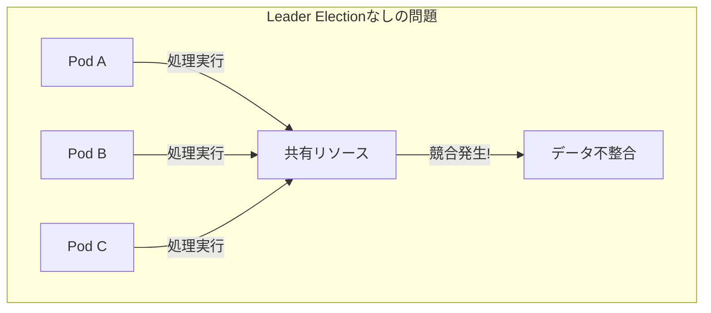

### 1.2 Leader Electionの解決策

Leader
Electionは、複数のPodの中から**1つだけをリーダーとして選出**し、その1つだけが特定の処理を担当する仕組みです。

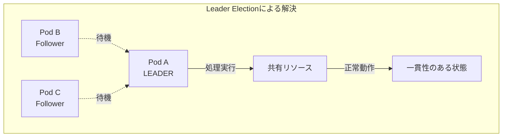

### 1.3 Kubernetesにおける実装

KubernetesのLeader
Electionは、**分散ロック**の仕組みを利用しています。これは、etcd（Kubernetesのバックエンドデータストア）の強い一貫性を活用した実装です。

---

## 2. アーキテクチャ概要

### 2.1 全体構成図

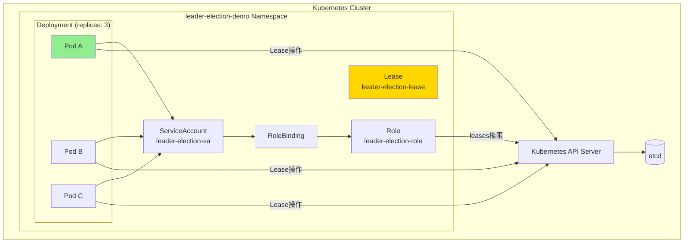

### 2.2 Leader Election の状態遷移

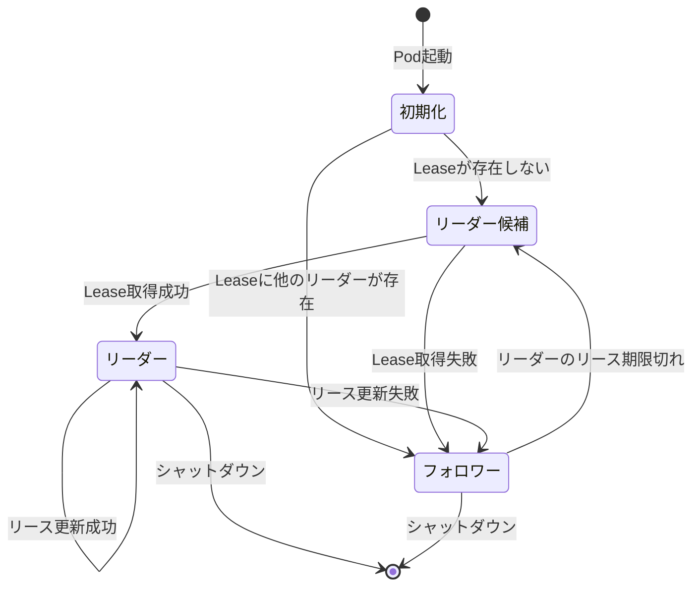

### 2.3 タイムライン：リーダー選出の流れ

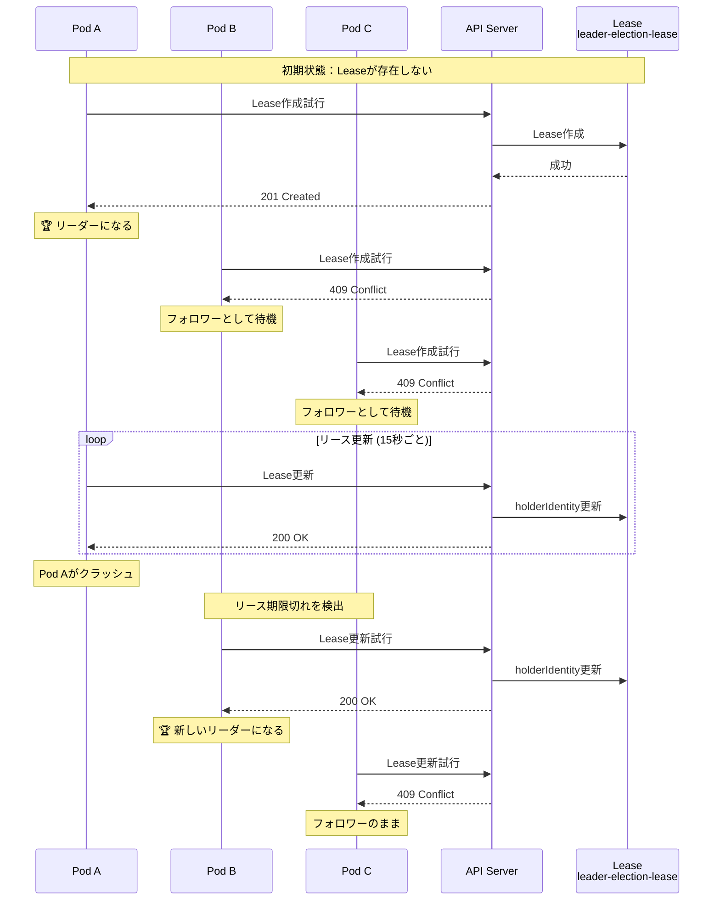

---

## 3. client-goの主要コンポーネント

### 3.1 InClusterConfig とは

`InClusterConfig` は、**Pod内からKubernetes
APIにアクセスするための認証情報を自動取得**する関数です。

#### 3.1.1 動作の仕組み

Pod内では、Kubernetesが自動的に以下のファイルをマウントします：

| パス                                                      | 内容                          |
| --------------------------------------------------------- | ----------------------------- |
| `/var/run/secrets/kubernetes.io/serviceaccount/token`     | ServiceAccountトークン（JWT） |
| `/var/run/secrets/kubernetes.io/serviceaccount/ca.crt`    | API Serverの証明書            |
| `/var/run/secrets/kubernetes.io/serviceaccount/namespace` | Podが属するNamespace          |

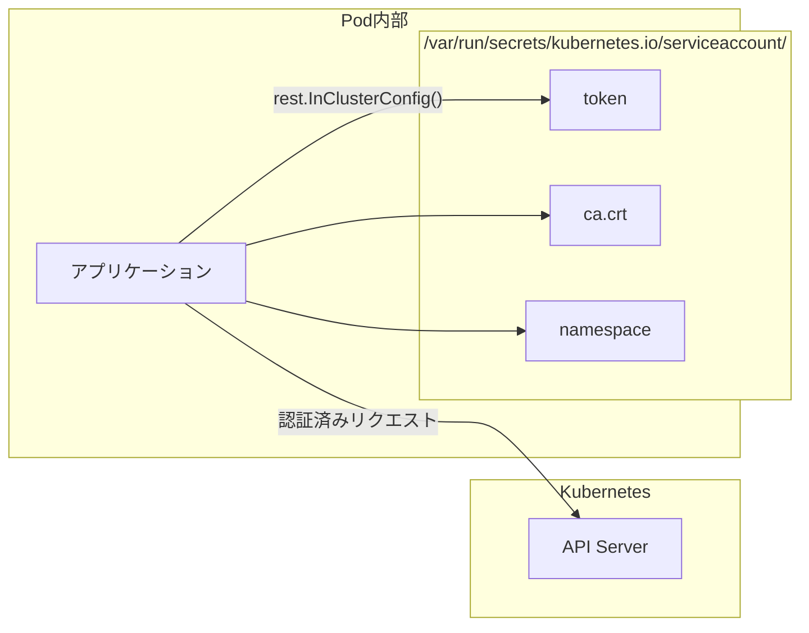

#### 3.1.2 コード例

```go
// Pod内で実行されることを前提とした設定取得
config, err := rest.InClusterConfig()
if err != nil {
    log.Fatalf("Failed to get in-cluster config: %v", err)
}

// この config には以下が自動設定されている
// - Host: Kubernetes API ServerのURL
// - TLSClientConfig: CA証明書
// - BearerToken: ServiceAccountトークン
```

#### 3.1.3 InClusterConfig vs 他の設定方法

| 設定方法                     | 用途                 | 認証情報の取得元                         |
| ---------------------------- | -------------------- | ---------------------------------------- |
| `InClusterConfig()`          | Pod内から            | 自動マウントされたServiceAccountトークン |
| `BuildConfigFromFlags()`     | 開発環境（ローカル） | kubeconfig ファイル（~/.kube/config）    |
| `RESTConfigFromKubeConfig()` | カスタム設定         | 任意のkubeconfigファイル                 |

---

### 3.2 リソースロック（Resource Lock）とは

リソースロックは、**分散システムにおけるロック（排他制御）の仕組み**をKubernetesリソースを使って実現するものです。

#### 3.2.1 リソースロックの種類

| 種類            | 使用するリソース               | 推奨度      | 説明                     |
| --------------- | ------------------------------ | ----------- | ------------------------ |
| `LeaseLock`     | `coordination.k8s.io/v1/Lease` | ⭐️⭐️⭐️ 推奨 | 最新かつ最も効率的       |
| `ConfigMapLock` | `v1/ConfigMap`                 | ⚠️ 非推奨   | 古い方式、レガシー互換用 |
| `EndpointsLock` | `v1/Endpoints`                 | ⚠️ 非推奨   | 古い方式、レガシー互換用 |

#### 3.2.2 Leaseリソースの構造

Leader Electionで使用されるLeaseリソースは、以下のような構造を持ちます：

```yaml
apiVersion: coordination.k8s.io/v1
kind: Lease
metadata:
    name: leader-election-lease
    namespace: leader-election-demo
spec:
    # 現在のリーダーのID（Pod名）
    holderIdentity: leader-election-xxxxx-yyyyy

    # リースの有効期間（秒）
    leaseDurationSeconds: 15

    # アクション数（更新のたびにインクリメント）
    leaseTransitions: 5

    # 最後にリースを取得した時刻
    acquireTime: "2024-01-01T00:00:00.000000Z"

    # 最後にリースを更新した時刻
    renewTime: "2024-01-01T00:00:30.000000Z"
```

#### 3.2.3 リソースロックの動作原理

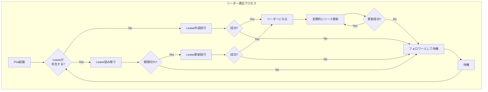

#### 3.2.4 楽観的ロック（Optimistic Locking）

KubernetesのLeaseは**楽観的ロック**を使用しています。これは、更新時に`resourceVersion`を確認することで、競合を検出する仕組みです。

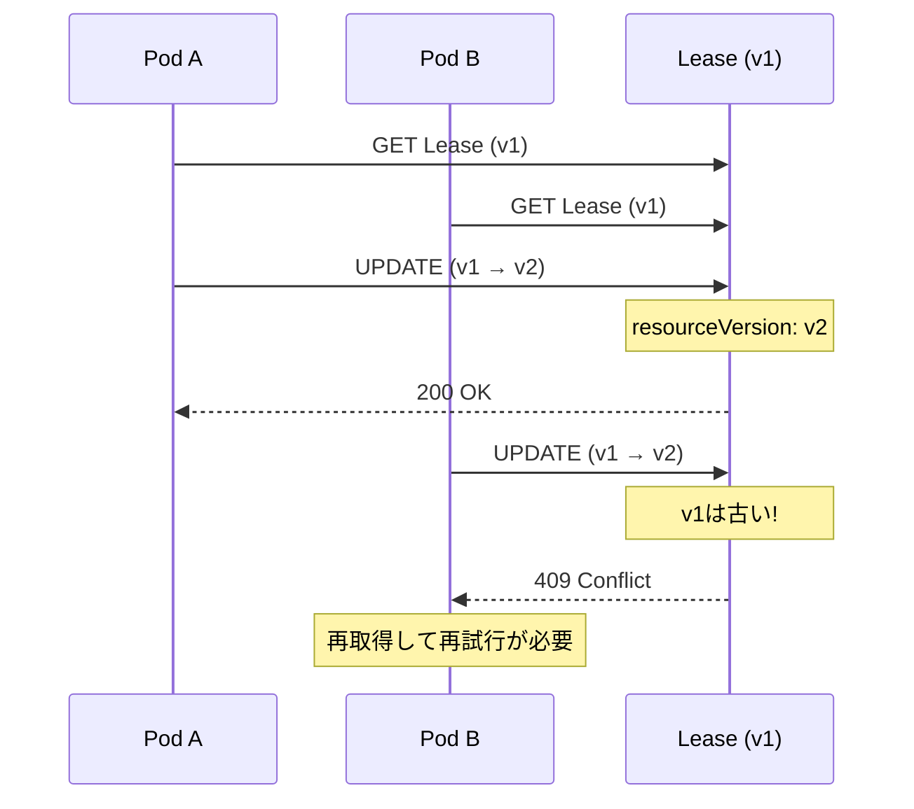

---

## 4. main関数の詳細解説

このセクションでは、本プロジェクトの `main.go` を一行ずつ解説します。

### 4.1 全体構造

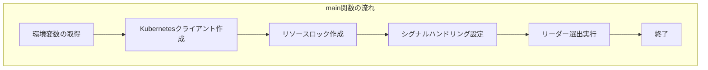

### 4.2 セクション別解説

#### 4.2.1 環境変数の取得

```go
// Pod名を環境変数から取得
podName := os.Getenv("POD_NAME")
if podName == "" {
    log.Fatal("POD_NAME environment variable must be set")
}

namespace := os.Getenv("NAMESPACE")
if namespace == "" {
    namespace = "leader-election-demo"
}
```

**解説**:

- `POD_NAME`: 各Podを一意に識別するID。Leaseの `holderIdentity` として使用される
- `NAMESPACE`: Leaseリソースが作成されるNamespace

これらは `deployment.yaml` で以下のように設定されています：

```yaml
env:
    - name: POD_NAME
      valueFrom:
          fieldRef:
              fieldPath: metadata.name # Podの名前を自動的に取得
    - name: NAMESPACE
      valueFrom:
          fieldRef:
              fieldPath: metadata.namespace # Namespaceを自動的に取得
```

#### 4.2.2 Kubernetesクライアントの作成

```go
// Kubernetes クライアントの作成
config, err := rest.InClusterConfig()
if err != nil {
    log.Fatalf("Failed to get in-cluster config: %v", err)
}

clientset, err := kubernetes.NewForConfig(config)
if err != nil {
    log.Fatalf("Failed to create clientset: %v", err)
}
```

**解説**:

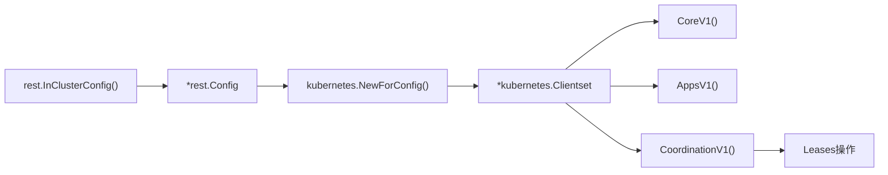

- `rest.InClusterConfig()`: Pod内の認証情報から設定を自動生成
- `kubernetes.NewForConfig()`: すべてのKubernetes
  APIにアクセスできるクライアントを作成
- `Clientset`: 各APIグループ（Core, Apps, Coordination等）へのアクセスを提供

#### 4.2.3 リソースロックの作成

```go
// リーダー選出の設定
leaseLockName := "leader-election-lease"
leaseLockNamespace := namespace

// リソースロックの作成
lock := &resourcelock.LeaseLock{
    LeaseMeta: metav1.ObjectMeta{
        Name:      leaseLockName,
        Namespace: leaseLockNamespace,
    },
    Client: clientset.CoordinationV1(),
    LockConfig: resourcelock.ResourceLockConfig{
        Identity: podName,
    },
}
```

**解説**:

| フィールド            | 説明                                            |
| --------------------- | ----------------------------------------------- |
| `LeaseMeta.Name`      | 作成されるLeaseリソースの名前                   |
| `LeaseMeta.Namespace` | Leaseリソースが作成されるNamespace              |
| `Client`              | Coordination APIへのクライアント（Lease操作用） |
| `LockConfig.Identity` | このPodを識別する一意のID（通常はPod名）        |

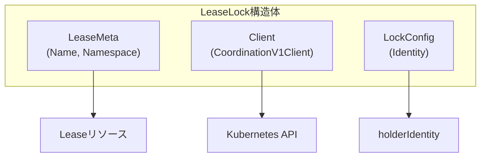

#### 4.2.4 シグナルハンドリング

```go
// シグナルハンドリング用のコンテキスト
ctx, cancel := context.WithCancel(context.Background())
defer cancel()

// SIGTERMとSIGINTをキャッチ
signalChan := make(chan os.Signal, 1)
signal.Notify(signalChan, syscall.SIGTERM, syscall.SIGINT)
go func() {
    <-signalChan
    log.Printf("[%s] Received termination signal, shutting down...", podName)
    cancel()
}()
```

**解説**:

- Graceful Shutdown を実現
- `SIGTERM`: Kubernetesがpodを終了する際に送信するシグナル
- `SIGINT`: Ctrl+C での終了
- `cancel()` を呼ぶことで、リーダーシップを明示的に放棄

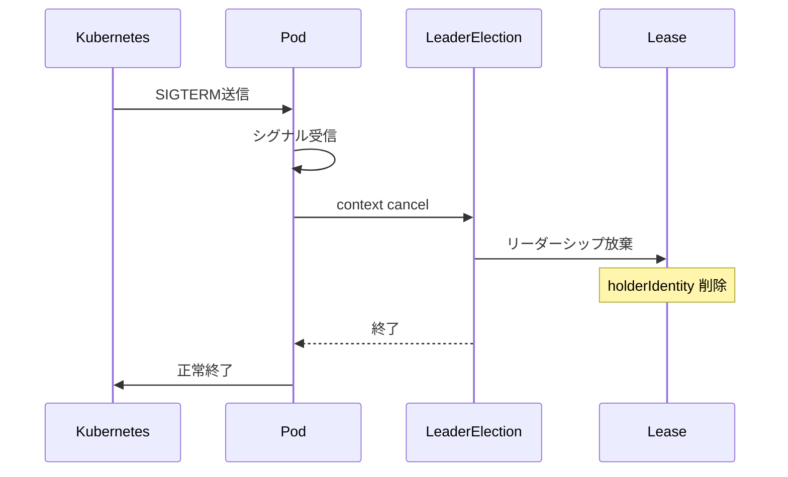

#### 4.2.5 リーダー状態の監視

```go
// 現在のリーダーを追跡
var currentLeader string

// リーダー状態を監視するゴルーチン
go func() {
    ticker := time.NewTicker(5 * time.Second)
    defer ticker.Stop()
    for {
        select {
        case <-ticker.C:
            if currentLeader == podName {
                log.Printf("[%s] >>> I am now the LEADER <<<", podName)
            } else if currentLeader != "" {
                log.Printf("[%s] New leader elected: %s", podName, currentLeader)
            }
        case <-ctx.Done():
            return
        }
    }
}()
```

**解説**:

- 5秒ごとに現在のリーダー状態をログ出力
- デバッグや監視に役立つ情報を提供
- コンテキストがキャンセルされると終了

#### 4.2.6 リーダー選出の実行

```go
leaderelection.RunOrDie(ctx, leaderelection.LeaderElectionConfig{
    Lock:            lock,
    ReleaseOnCancel: true,
    LeaseDuration:   15 * time.Second,
    RenewDeadline:   10 * time.Second,
    RetryPeriod:     2 * time.Second,
    Callbacks: leaderelection.LeaderCallbacks{
        OnStartedLeading: func(ctx context.Context) {
            currentLeader = podName
            log.Printf("[%s] >>> I am now the LEADER <<<", podName)
        },
        OnStoppedLeading: func() {
            log.Printf("[%s] Lost leadership", podName)
        },
        OnNewLeader: func(identity string) {
            if identity == podName {
                return
            }
            currentLeader = identity
            log.Printf("[%s] New leader elected: %s", podName, identity)
        },
    },
})
```

**重要なパラメータの解説**:

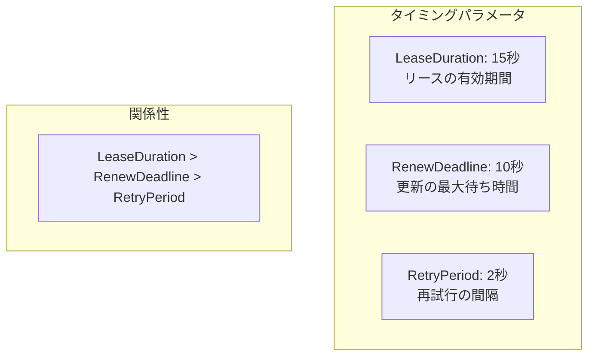

| パラメータ        | 値                        | 説明                                                 |
| ----------------- | ------------------------- | ---------------------------------------------------- |
| `Lock`            | `*resourcelock.LeaseLock` | 使用するリソースロック                               |
| `ReleaseOnCancel` | `true`                    | Contextキャンセル時にリーダーシップを放棄            |
| `LeaseDuration`   | 15秒                      | リースの有効期間。この時間内に更新がなければ期限切れ |
| `RenewDeadline`   | 10秒                      | リース更新の最大待ち時間                             |
| `RetryPeriod`     | 2秒                       | リース取得/更新の再試行間隔                          |

**コールバック関数**:

| コールバック       | 呼び出しタイミング                                  |
| ------------------ | --------------------------------------------------- |
| `OnStartedLeading` | このPodがリーダーになった時                         |
| `OnStoppedLeading` | このPodがリーダーシップを失った時                   |
| `OnNewLeader`      | 新しいリーダーが選出された時（全Pod共通で呼ばれる） |

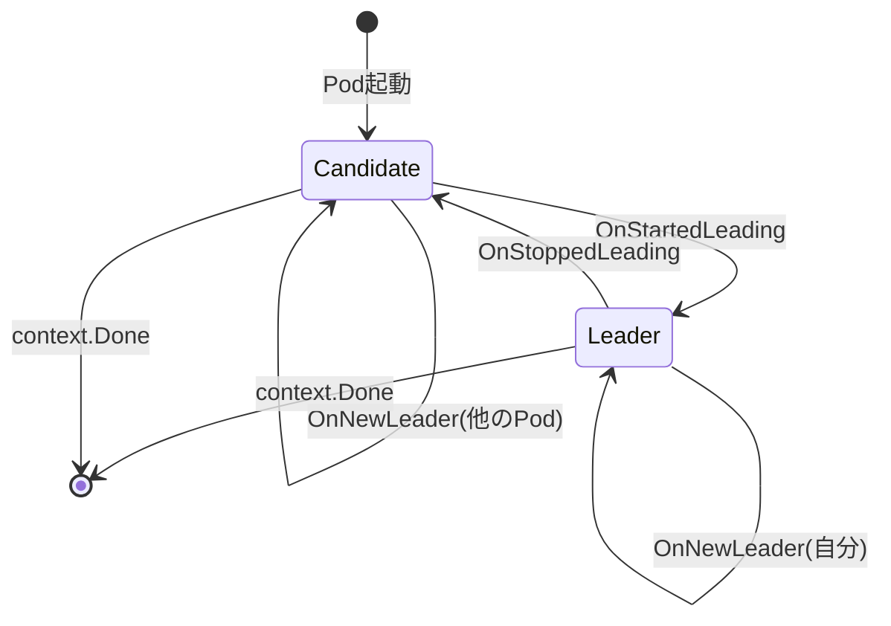

---

## 5. ServiceAccountが必要な理由

### 5.1 Kubernetesの認証・認可モデル

Kubernetesでは、すべてのAPI呼び出しは **認証（Authentication）** と
**認可（Authorization）** を通過する必要があります。

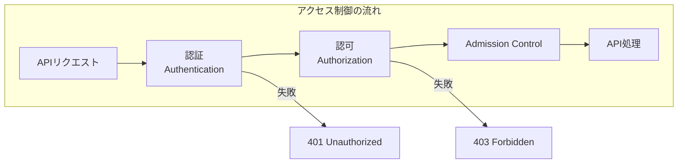

### 5.2 ServiceAccountの役割

ServiceAccountは、**Pod内のアプリケーションがKubernetes
APIにアクセスするためのIDentity**です。

| 認証主体            | 用途                                |
| ------------------- | ----------------------------------- |
| User Account        | 人間のユーザー（kubectl使用者など） |
| **Service Account** | Pod内で動作するアプリケーション     |

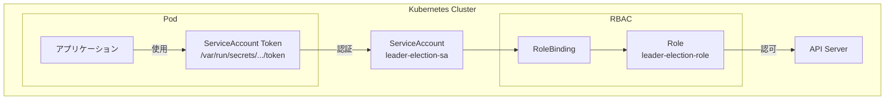

### 5.3 本プロジェクトのRBAC設定

#### 5.3.1 ServiceAccount

```yaml
apiVersion: v1
kind: ServiceAccount
metadata:
    name: leader-election-sa
    namespace: leader-election-demo
```

#### 5.3.2 Role（権限の定義）

```yaml
apiVersion: rbac.authorization.k8s.io/v1
kind: Role
metadata:
    name: leader-election-role
    namespace: leader-election-demo
rules:
    - apiGroups: ["coordination.k8s.io"]
      resources: ["leases"]
      verbs: ["get", "watch", "list", "create", "update", "patch", "delete"]
```

**各verbの用途**:

| Verb     | Leader Electionでの用途             |
| -------- | ----------------------------------- |
| `get`    | 現在のLeaseの状態を取得             |
| `watch`  | Leaseの変更を監視                   |
| `list`   | Leaseの一覧を取得                   |
| `create` | 最初のリーダーがLeaseを作成         |
| `update` | リーダーがLeaseを更新（リース延長） |
| `patch`  | Leaseの部分更新                     |
| `delete` | 終了時にLeaseを削除                 |

#### 5.3.3 RoleBinding（紐付け）

```yaml
apiVersion: rbac.authorization.k8s.io/v1
kind: RoleBinding
metadata:
    name: leader-election-rolebinding
    namespace: leader-election-demo
subjects:
    - kind: ServiceAccount
      name: leader-election-sa
      namespace: leader-election-demo
roleRef:
    kind: Role
    name: leader-election-role
    apiGroup: rbac.authorization.k8s.io
```

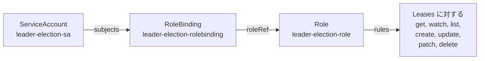

### 5.4 ServiceAccountがない場合

ServiceAccountを設定しない場合、以下のようなエラーが発生します：

```
leases.coordination.k8s.io "leader-election-lease" is forbidden:
User "system:serviceaccount:leader-election-demo:default" cannot create
resource "leases" in API group "coordination.k8s.io" in the namespace
"leader-election-demo"
```

これは、`default` ServiceAccountには `leases`
リソースへのアクセス権限がないためです。

---

## 6. 実践的な設定のポイント

### 6.1 タイミングパラメータの調整

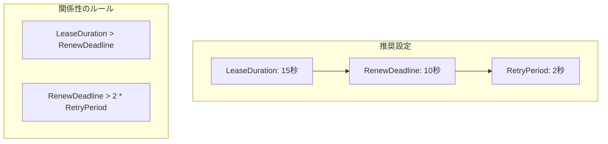

| シナリオ     | LeaseDuration | RenewDeadline | RetryPeriod | 特徴                     |
| ------------ | ------------- | ------------- | ----------- | ------------------------ |
| **標準**     | 15秒          | 10秒          | 2秒         | バランスの取れた設定     |
| **高可用性** | 10秒          | 8秒           | 1秒         | フェイルオーバーが速い   |
| **低負荷**   | 60秒          | 45秒          | 5秒         | API Serverへの負荷が低い |

### 6.2 よくある問題と対処法

#### 問題1: リーダーが頻繁に切り替わる

**原因**: ネットワーク遅延やAPI
ServerのレスポンスによりRenewDeadlineに間に合わない

**対処**:

- `LeaseDuration`と`RenewDeadline`を長めに設定
- API Serverへのネットワーク品質を確認

#### 問題2: フェイルオーバーが遅い

**原因**: `LeaseDuration`が長すぎる

**対処**:

- `LeaseDuration`を短くする（ただし、ネットワーク遅延を考慮）

#### 問題3: 権限エラー

**原因**: RBAC設定の不足

**対処**:

- ServiceAccount、Role、RoleBindingが正しく設定されているか確認
- `kubectl auth can-i` コマンドで権限を確認

```bash
# ServiceAccountの権限を確認
kubectl auth can-i create leases \
  --namespace leader-election-demo \
  --as system:serviceaccount:leader-election-demo:leader-election-sa
```

### 6.3 デバッグ方法

```bash
# Leaseの状態を確認
kubectl get lease leader-election-lease -n leader-election-demo -o yaml

# Podのログを確認
kubectl logs -f -l app=leader-election -n leader-election-demo

# リーダーの特定
kubectl get lease leader-election-lease -n leader-election-demo \
  -o jsonpath='{.spec.holderIdentity}'
```

---

## 📝 まとめ

本ガイドでは、Kubernetes Leader Electionの以下の内容を学びました：

1. **Leader Electionの必要性**: 分散システムにおける排他制御の重要性
2. **client-goのコンポーネント**:
   - `InClusterConfig`: Pod内から認証情報を自動取得
   - `LeaseLock`: 分散ロックをLeaseリソースで実現
3. **main関数の実装**: 各セクションの役割と実装方法
4. **ServiceAccountの必要性**: Kubernetes APIへのアクセス認証・認可

---

## 📚 参考リンク

- [client-go LeaderElection package](https://pkg.go.dev/k8s.io/client-go/tools/leaderelection)
- [Kubernetes Lease API](https://kubernetes.io/docs/concepts/architecture/leases/)
- [Kubernetes RBAC](https://kubernetes.io/docs/reference/access-authn-authz/rbac/)
