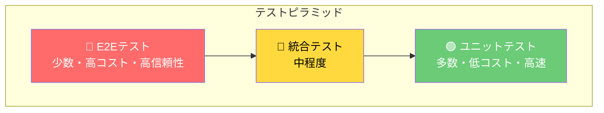
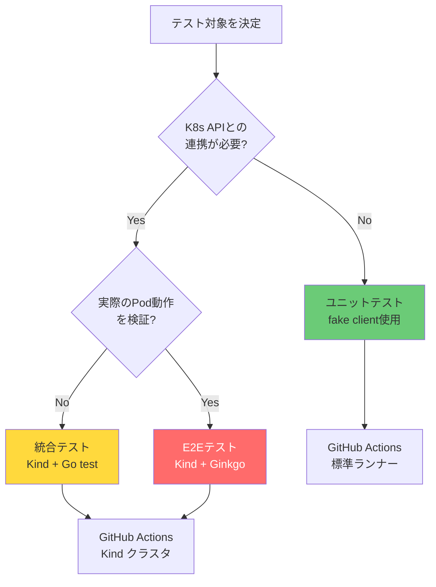
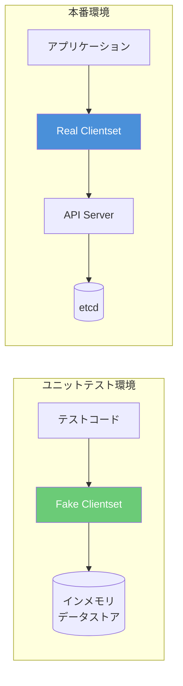
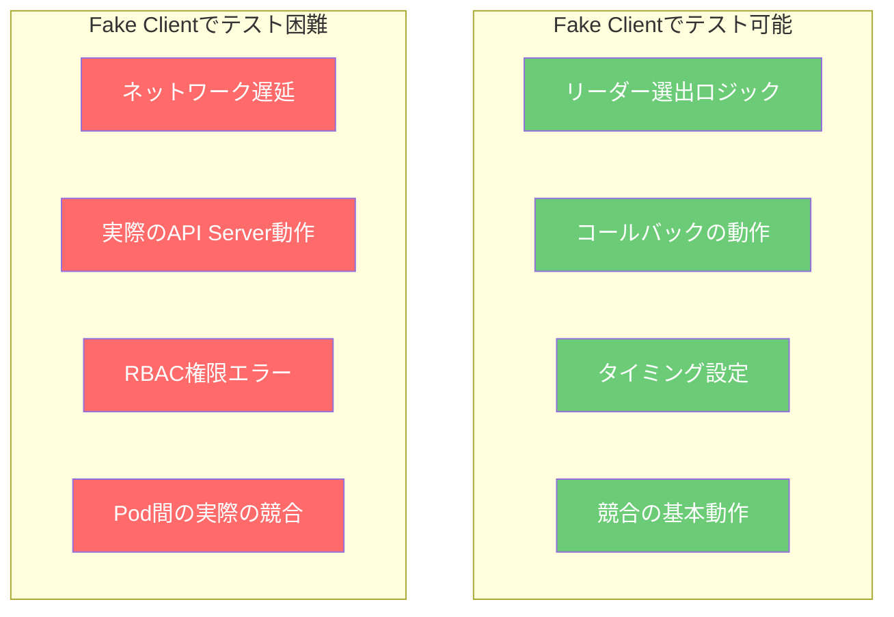
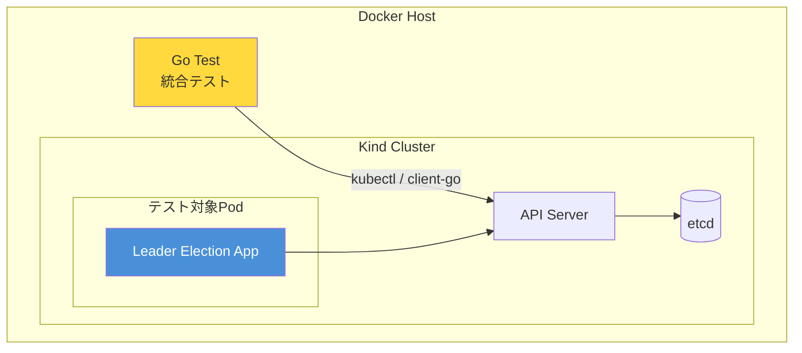
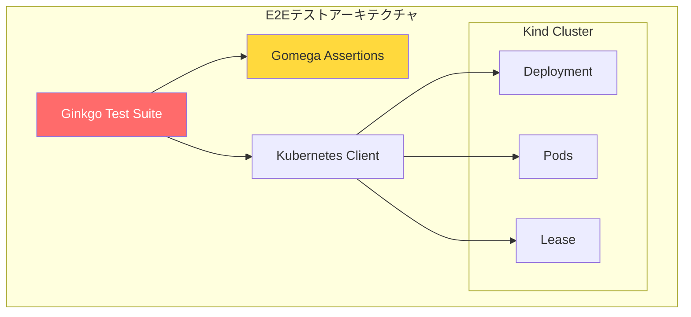
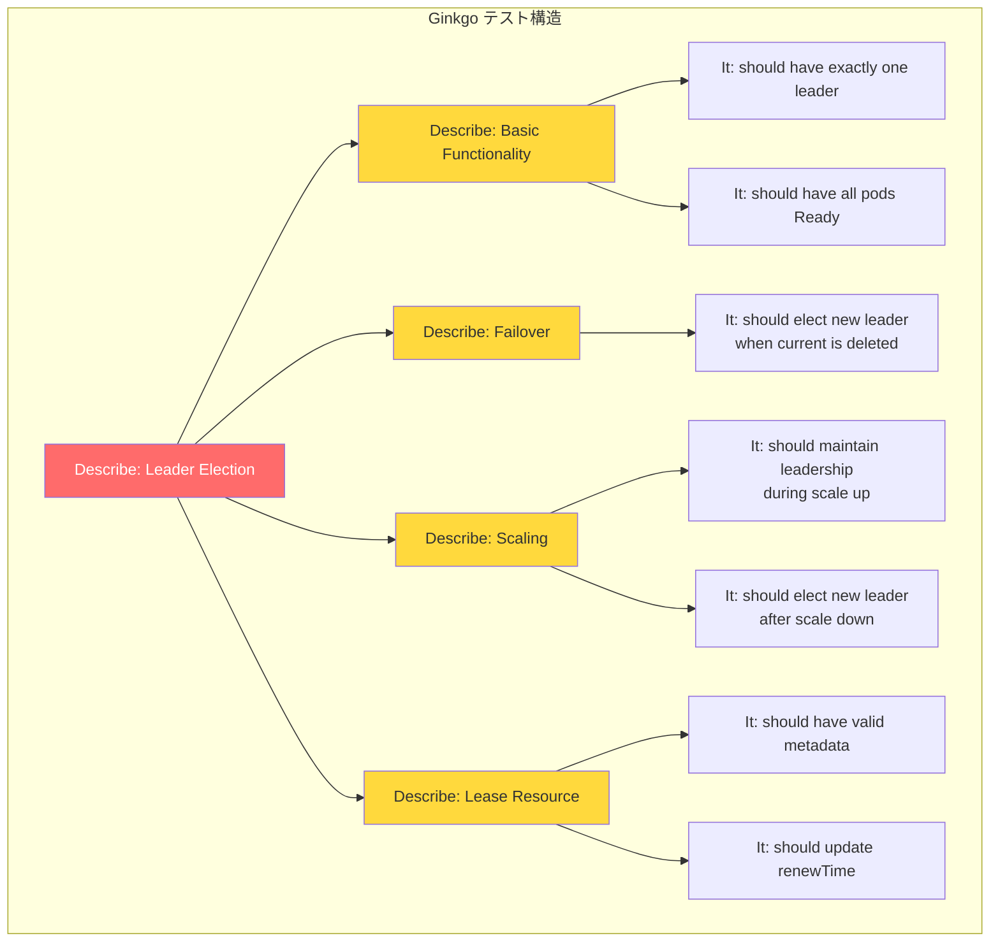
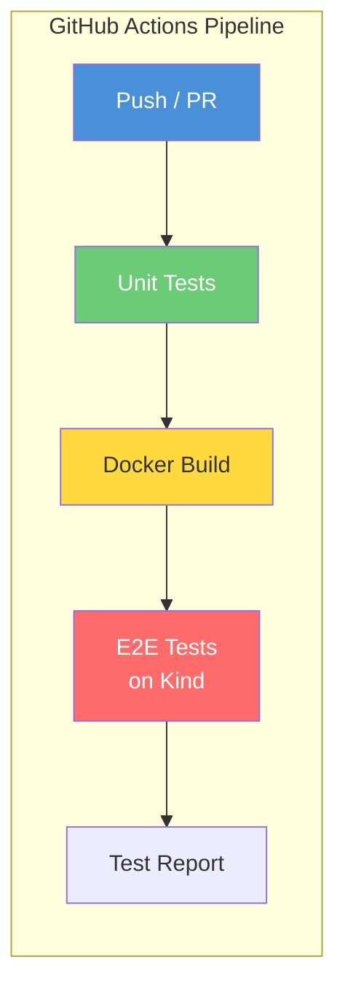
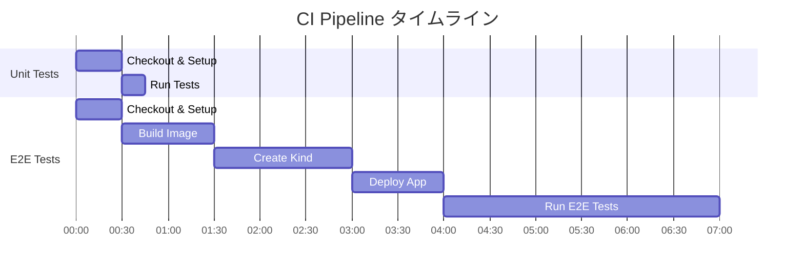

# Leader Election テスト完全ガイド

> **対象読者**: Kubernetesの基本的な操作は理解しているが、Leader
> Electionアプリケーションのテスト方法を学びたいGoエンジニア

## 📚 目次

1. [テスト戦略の概要](#1-テスト戦略の概要)
2. [ユニットテスト](#2-ユニットテスト)
3. [統合テスト](#3-統合テスト)
4. [E2Eテスト（Ginkgo）](#4-e2eテストginkgo)
5. [GitHub Actions でのCI/CD設定](#5-github-actions-でのcicd設定)
6. [テストのベストプラクティス](#6-テストのベストプラクティス)

---

## 1. テスト戦略の概要

### 1.1 テストピラミッド

Leader Electionのテストは、以下の3層で構成することを推奨します。



### 1.2 各テストレベルの特徴

| テストレベル       | 実行速度          | K8sクラスタ |   CIでの実行    | カバー範囲     |
| ------------------ | ----------------- | :---------: | :-------------: | -------------- |
| **ユニットテスト** | ⚡ 高速（数秒）   |   ❌ 不要   |     ✅ 容易     | ロジックの検証 |
| **統合テスト**     | 🚀 中速（数分）   |   ✅ 必要   | ✅ 可能（Kind） | APIとの連携    |
| **E2Eテスト**      | 🐢 低速（数分〜） |   ✅ 必要   | ✅ 可能（Kind） | シナリオ全体   |

### 1.3 テスト環境の選択



---

## 2. ユニットテスト

### 2.1 概要

ユニットテストでは、`client-go` の **fake client**
を使用して、実際のKubernetesクラスタなしでLeader
Electionのロジックをテストします。



### 2.2 必要なパッケージ

```go
import (
    "context"
    "testing"
    "time"

    metav1 "k8s.io/apimachinery/pkg/apis/meta/v1"
    "k8s.io/client-go/kubernetes/fake"
    "k8s.io/client-go/tools/leaderelection"
    "k8s.io/client-go/tools/leaderelection/resourcelock"
)
```

### 2.3 基本的なテストパターン

#### 2.3.1 リーダー選出の成功テスト

```go
// main_test.go
package main

import (
    "context"
    "sync"
    "testing"
    "time"

    metav1 "k8s.io/apimachinery/pkg/apis/meta/v1"
    "k8s.io/client-go/kubernetes/fake"
    "k8s.io/client-go/tools/leaderelection"
    "k8s.io/client-go/tools/leaderelection/resourcelock"
)

func TestLeaderElection_SingleCandidate(t *testing.T) {
    // Arrange: Fake clientset を作成
    clientset := fake.NewSimpleClientset()

    ctx, cancel := context.WithTimeout(context.Background(), 30*time.Second)
    defer cancel()

    lock := &resourcelock.LeaseLock{
        LeaseMeta: metav1.ObjectMeta{
            Name:      "test-lease",
            Namespace: "default",
        },
        Client: clientset.CoordinationV1(),
        LockConfig: resourcelock.ResourceLockConfig{
            Identity: "test-pod-1",
        },
    }

    // Act: リーダー選出を実行
    leaderElected := make(chan struct{})
    var wg sync.WaitGroup
    wg.Add(1)

    go func() {
        defer wg.Done()
        leaderelection.RunOrDie(ctx, leaderelection.LeaderElectionConfig{
            Lock:            lock,
            ReleaseOnCancel: true,
            LeaseDuration:   5 * time.Second,
            RenewDeadline:   3 * time.Second,
            RetryPeriod:     1 * time.Second,
            Callbacks: leaderelection.LeaderCallbacks{
                OnStartedLeading: func(ctx context.Context) {
                    close(leaderElected)
                    // リーダーとしての処理をシミュレート
                    <-ctx.Done()
                },
                OnStoppedLeading: func() {
                    t.Log("Leadership lost")
                },
                OnNewLeader: func(identity string) {
                    t.Logf("New leader: %s", identity)
                },
            },
        })
    }()

    // Assert: リーダーになることを確認
    select {
    case <-leaderElected:
        t.Log("✅ Successfully became leader")
    case <-time.After(10 * time.Second):
        t.Fatal("❌ Timeout waiting to become leader")
    }

    // クリーンアップ
    cancel()
    wg.Wait()
}
```

#### 2.3.2 複数候補者での競合テスト

```go
func TestLeaderElection_MultipleCandidates(t *testing.T) {
    clientset := fake.NewSimpleClientset()

    ctx, cancel := context.WithTimeout(context.Background(), 30*time.Second)
    defer cancel()

    const numCandidates = 3
    leaders := make(chan string, numCandidates)
    var wg sync.WaitGroup

    // 複数の候補者を起動
    for i := 0; i < numCandidates; i++ {
        wg.Add(1)
        podName := fmt.Sprintf("test-pod-%d", i)

        go func(identity string) {
            defer wg.Done()

            lock := &resourcelock.LeaseLock{
                LeaseMeta: metav1.ObjectMeta{
                    Name:      "test-lease",
                    Namespace: "default",
                },
                Client: clientset.CoordinationV1(),
                LockConfig: resourcelock.ResourceLockConfig{
                    Identity: identity,
                },
            }

            leaderelection.RunOrDie(ctx, leaderelection.LeaderElectionConfig{
                Lock:            lock,
                ReleaseOnCancel: true,
                LeaseDuration:   5 * time.Second,
                RenewDeadline:   3 * time.Second,
                RetryPeriod:     1 * time.Second,
                Callbacks: leaderelection.LeaderCallbacks{
                    OnStartedLeading: func(ctx context.Context) {
                        leaders <- identity
                        <-ctx.Done()
                    },
                    OnStoppedLeading: func() {},
                    OnNewLeader:      func(identity string) {},
                },
            })
        }(podName)
    }

    // Assert: 1つだけがリーダーになることを確認
    select {
    case leader := <-leaders:
        t.Logf("✅ Leader elected: %s", leader)

        // 短時間待機して他のリーダーがいないことを確認
        select {
        case duplicateLeader := <-leaders:
            t.Fatalf("❌ Multiple leaders detected: %s", duplicateLeader)
        case <-time.After(3 * time.Second):
            t.Log("✅ Only one leader exists")
        }
    case <-time.After(10 * time.Second):
        t.Fatal("❌ No leader elected")
    }

    cancel()
    wg.Wait()
}
```

#### 2.3.3 リーダーシップ放棄のテスト

```go
func TestLeaderElection_GracefulShutdown(t *testing.T) {
    clientset := fake.NewSimpleClientset()

    ctx, cancel := context.WithCancel(context.Background())
    
    lock := &resourcelock.LeaseLock{
        LeaseMeta: metav1.ObjectMeta{
            Name:      "test-lease",
            Namespace: "default",
        },
        Client: clientset.CoordinationV1(),
        LockConfig: resourcelock.ResourceLockConfig{
            Identity: "test-pod-1",
        },
    }

    leadershipLost := make(chan struct{})
    leaderStarted := make(chan struct{})
    
    go func() {
        leaderelection.RunOrDie(ctx, leaderelection.LeaderElectionConfig{
            Lock:            lock,
            ReleaseOnCancel: true,  // 重要: キャンセル時にリーダーシップを放棄
            LeaseDuration:   5 * time.Second,
            RenewDeadline:   3 * time.Second,
            RetryPeriod:     1 * time.Second,
            Callbacks: leaderelection.LeaderCallbacks{
                OnStartedLeading: func(ctx context.Context) {
                    close(leaderStarted)
                    <-ctx.Done()
                },
                OnStoppedLeading: func() {
                    close(leadershipLost)
                },
                OnNewLeader: func(identity string) {},
            },
        })
    }()

    // リーダーになるのを待つ
    <-leaderStarted
    t.Log("Leader started")

    // コンテキストをキャンセル
    cancel()

    // リーダーシップが放棄されることを確認
    select {
    case <-leadershipLost:
        t.Log("✅ Leadership gracefully released")
    case <-time.After(10 * time.Second):
        t.Fatal("❌ Leadership was not released")
    }
}
```

### 2.4 テストの実行

```bash
# すべてのユニットテストを実行
go test -v ./...

# 特定のテストを実行
go test -v -run TestLeaderElection_SingleCandidate

# カバレッジを取得
go test -v -coverprofile=coverage.out ./...
go tool cover -html=coverage.out -o coverage.html
```

### 2.5 Fake Clientの制限事項



---

## 3. 統合テスト

### 3.1 概要

統合テストでは、**Kind（Kubernetes in Docker）**
を使用して、実際のKubernetesクラスタ環境でテストを行います。



### 3.2 Kind クラスタのセットアップ

#### 3.2.1 Kind のインストール

```bash
# macOS (Homebrew)
brew install kind

# Linux
curl -Lo ./kind https://kind.sigs.k8s.io/dl/v0.20.0/kind-linux-amd64
chmod +x ./kind
sudo mv ./kind /usr/local/bin/kind

# Go install
go install sigs.k8s.io/kind@v0.20.0
```

#### 3.2.2 テスト用クラスタの作成

```bash
# クラスタを作成
kind create cluster --name leader-election-test

# イメージをビルドしてクラスタにロード
docker build -t leader-election:test .
kind load docker-image leader-election:test --name leader-election-test

# マニフェストをデプロイ
kubectl apply -f k8s/namespace.yaml
kubectl apply -f k8s/rbac.yaml

# テスト用のイメージタグに更新してデプロイ
sed 's|leader-election:latest|leader-election:test|g' k8s/deployment.yaml | kubectl apply -f -

# Pod が起動するまで待機
kubectl rollout status deployment/leader-election -n leader-election-demo --timeout=120s
```

### 3.3 統合テストの実装

#### 3.3.1 テストヘルパー関数

```go
// integration_test.go
//go:build integration
// +build integration

package main

import (
    "context"
    "os"
    "path/filepath"
    "testing"
    "time"

    coordinationv1 "k8s.io/api/coordination/v1"
    metav1 "k8s.io/apimachinery/pkg/apis/meta/v1"
    "k8s.io/client-go/kubernetes"
    "k8s.io/client-go/tools/clientcmd"
)

const (
    testNamespace = "leader-election-demo"
    leaseName     = "leader-election-lease"
)

// テスト用のKubernetesクライアントを取得
func getTestClientset(t *testing.T) *kubernetes.Clientset {
    t.Helper()

    kubeconfig := os.Getenv("KUBECONFIG")
    if kubeconfig == "" {
        home, _ := os.UserHomeDir()
        kubeconfig = filepath.Join(home, ".kube", "config")
    }

    config, err := clientcmd.BuildConfigFromFlags("", kubeconfig)
    if err != nil {
        t.Fatalf("Failed to build config: %v", err)
    }

    clientset, err := kubernetes.NewForConfig(config)
    if err != nil {
        t.Fatalf("Failed to create clientset: %v", err)
    }

    return clientset
}

// Leaseの現在のホルダーを取得
func getCurrentLeader(t *testing.T, clientset *kubernetes.Clientset) string {
    t.Helper()

    ctx := context.Background()
    lease, err := clientset.CoordinationV1().Leases(testNamespace).Get(
        ctx, leaseName, metav1.GetOptions{},
    )
    if err != nil {
        return ""
    }

    if lease.Spec.HolderIdentity == nil {
        return ""
    }

    return *lease.Spec.HolderIdentity
}

// 特定の条件が満たされるまで待機
func waitFor(t *testing.T, timeout time.Duration, condition func() bool, message string) {
    t.Helper()

    deadline := time.Now().Add(timeout)
    for time.Now().Before(deadline) {
        if condition() {
            return
        }
        time.Sleep(1 * time.Second)
    }
    t.Fatalf("Timeout waiting for: %s", message)
}
```

#### 3.3.2 リーダー存在確認テスト

```go
func TestIntegration_LeaderExists(t *testing.T) {
    clientset := getTestClientset(t)

    // リーダーが選出されるのを待つ
    waitFor(t, 30*time.Second, func() bool {
        leader := getCurrentLeader(t, clientset)
        return leader != ""
    }, "leader to be elected")

    leader := getCurrentLeader(t, clientset)
    t.Logf("✅ Current leader: %s", leader)
}
```

#### 3.3.3 フェイルオーバーテスト

```go
func TestIntegration_Failover(t *testing.T) {
    clientset := getTestClientset(t)
    ctx := context.Background()

    // 現在のリーダーを取得
    originalLeader := getCurrentLeader(t, clientset)
    if originalLeader == "" {
        t.Fatal("No leader found")
    }
    t.Logf("Original leader: %s", originalLeader)

    // リーダーPodを削除
    err := clientset.CoreV1().Pods(testNamespace).Delete(
        ctx, originalLeader, metav1.DeleteOptions{},
    )
    if err != nil {
        t.Fatalf("Failed to delete leader pod: %v", err)
    }
    t.Log("Leader pod deleted")

    // 新しいリーダーが選出されるのを待つ
    waitFor(t, 60*time.Second, func() bool {
        newLeader := getCurrentLeader(t, clientset)
        return newLeader != "" && newLeader != originalLeader
    }, "new leader to be elected")

    newLeader := getCurrentLeader(t, clientset)
    t.Logf("✅ New leader elected: %s", newLeader)

    if newLeader == originalLeader {
        t.Fatal("❌ Leader did not change")
    }
}
```

#### 3.3.4 スケーリングテスト

```go
func TestIntegration_ScaleUp(t *testing.T) {
    clientset := getTestClientset(t)
    ctx := context.Background()

    // 現在のリーダーを取得
    originalLeader := getCurrentLeader(t, clientset)
    t.Logf("Original leader: %s", originalLeader)

    // レプリカ数を増やす
    deployment, err := clientset.AppsV1().Deployments(testNamespace).Get(
        ctx, "leader-election", metav1.GetOptions{},
    )
    if err != nil {
        t.Fatalf("Failed to get deployment: %v", err)
    }

    originalReplicas := *deployment.Spec.Replicas
    newReplicas := int32(5)
    deployment.Spec.Replicas = &newReplicas

    _, err = clientset.AppsV1().Deployments(testNamespace).Update(
        ctx, deployment, metav1.UpdateOptions{},
    )
    if err != nil {
        t.Fatalf("Failed to scale deployment: %v", err)
    }
    t.Logf("Scaled from %d to %d replicas", originalReplicas, newReplicas)

    // すべてのPodが起動するのを待つ
    waitFor(t, 120*time.Second, func() bool {
        pods, _ := clientset.CoreV1().Pods(testNamespace).List(ctx, metav1.ListOptions{
            LabelSelector: "app=leader-election",
        })
        readyCount := 0
        for _, pod := range pods.Items {
            for _, cond := range pod.Status.Conditions {
                if cond.Type == "Ready" && cond.Status == "True" {
                    readyCount++
                }
            }
        }
        return readyCount == int(newReplicas)
    }, "all pods to be ready")

    // リーダーが変わっていないことを確認
    currentLeader := getCurrentLeader(t, clientset)
    if currentLeader != originalLeader {
        t.Logf("⚠️ Leader changed from %s to %s during scale up", originalLeader, currentLeader)
    } else {
        t.Log("✅ Leader remained stable during scale up")
    }

    // クリーンアップ: 元のレプリカ数に戻す
    deployment.Spec.Replicas = &originalReplicas
    _, _ = clientset.AppsV1().Deployments(testNamespace).Update(ctx, deployment, metav1.UpdateOptions{})
}
```

### 3.4 統合テストの実行

```bash
# Kind クラスタが必要
kind create cluster --name leader-election-test

# 統合テストを実行（ビルドタグを指定）
go test -v -tags=integration ./...

# タイムアウトを長めに設定
go test -v -tags=integration -timeout=10m ./...
```

### 3.5 クリーンアップ

```bash
# Kindクラスタを削除
kind delete cluster --name leader-election-test
```

---

## 4. E2Eテスト（Ginkgo）

### 4.1 概要

E2Eテストでは、**Ginkgo** と **Gomega**
を使用して、BDDスタイルの読みやすいテストを記述します。



### 4.2 ディレクトリ構成

```
k8s-leader-election-sample/
├── main.go
├── main_test.go              # ユニットテスト
├── e2e/                      # E2Eテスト
│   ├── e2e_suite_test.go     # テストスイート設定
│   ├── leader_election_test.go
│   └── utils.go              # ヘルパー関数
└── .github/
    └── workflows/
        └── e2e.yaml
```

### 4.3 セットアップ

```bash
# Ginkgo CLI のインストール
go install github.com/onsi/ginkgo/v2/ginkgo@latest

# 依存関係の追加
go get github.com/onsi/ginkgo/v2
go get github.com/onsi/gomega

# E2Eテストディレクトリの作成
mkdir -p e2e
cd e2e

# テストスイートの初期化
ginkgo bootstrap
```

### 4.4 テストスイートの実装

#### 4.4.1 スイート設定（e2e_suite_test.go）

```go
// e2e/e2e_suite_test.go
package e2e

import (
    "os"
    "path/filepath"
    "testing"

    . "github.com/onsi/ginkgo/v2"
    . "github.com/onsi/gomega"
    "k8s.io/client-go/kubernetes"
    "k8s.io/client-go/tools/clientcmd"
)

var (
    clientset *kubernetes.Clientset
    namespace = "leader-election-demo"
)

func TestE2E(t *testing.T) {
    RegisterFailHandler(Fail)
    RunSpecs(t, "Leader Election E2E Suite")
}

var _ = BeforeSuite(func() {
    By("Setting up Kubernetes client")

    kubeconfig := os.Getenv("KUBECONFIG")
    if kubeconfig == "" {
        home, err := os.UserHomeDir()
        Expect(err).NotTo(HaveOccurred())
        kubeconfig = filepath.Join(home, ".kube", "config")
    }

    config, err := clientcmd.BuildConfigFromFlags("", kubeconfig)
    Expect(err).NotTo(HaveOccurred(), "Failed to build kubeconfig")

    clientset, err = kubernetes.NewForConfig(config)
    Expect(err).NotTo(HaveOccurred(), "Failed to create clientset")

    By("Kubernetes client ready")
})

var _ = AfterSuite(func() {
    By("Cleaning up resources")
    // 必要に応じてクリーンアップ
})
```

#### 4.4.2 ヘルパー関数（utils.go）

```go
// e2e/utils.go
package e2e

import (
    "context"
    "time"

    metav1 "k8s.io/apimachinery/pkg/apis/meta/v1"
    "k8s.io/client-go/kubernetes"
)

const (
    leaseName      = "leader-election-lease"
    deploymentName = "leader-election"
    appLabel       = "app=leader-election"
)

// GetCurrentLeader returns the current leader's identity
func GetCurrentLeader(ctx context.Context, cs *kubernetes.Clientset, ns string) (string, error) {
    lease, err := cs.CoordinationV1().Leases(ns).Get(ctx, leaseName, metav1.GetOptions{})
    if err != nil {
        return "", err
    }
    if lease.Spec.HolderIdentity == nil {
        return "", nil
    }
    return *lease.Spec.HolderIdentity, nil
}

// GetReadyPodCount returns the count of ready pods
func GetReadyPodCount(ctx context.Context, cs *kubernetes.Clientset, ns string) (int, error) {
    pods, err := cs.CoreV1().Pods(ns).List(ctx, metav1.ListOptions{
        LabelSelector: appLabel,
    })
    if err != nil {
        return 0, err
    }

    readyCount := 0
    for _, pod := range pods.Items {
        for _, cond := range pod.Status.Conditions {
            if cond.Type == "Ready" && cond.Status == "True" {
                readyCount++
            }
        }
    }
    return readyCount, nil
}

// DeletePod deletes a pod by name
func DeletePod(ctx context.Context, cs *kubernetes.Clientset, ns, name string) error {
    return cs.CoreV1().Pods(ns).Delete(ctx, name, metav1.DeleteOptions{})
}

// ScaleDeployment scales a deployment to the specified replicas
func ScaleDeployment(ctx context.Context, cs *kubernetes.Clientset, ns string, replicas int32) error {
    deployment, err := cs.AppsV1().Deployments(ns).Get(ctx, deploymentName, metav1.GetOptions{})
    if err != nil {
        return err
    }
    deployment.Spec.Replicas = &replicas
    _, err = cs.AppsV1().Deployments(ns).Update(ctx, deployment, metav1.UpdateOptions{})
    return err
}
```

#### 4.4.3 メインテスト（leader_election_test.go）

```go
// e2e/leader_election_test.go
package e2e

import (
    "context"
    "time"

    . "github.com/onsi/ginkgo/v2"
    . "github.com/onsi/gomega"
    metav1 "k8s.io/apimachinery/pkg/apis/meta/v1"
)

var _ = Describe("Leader Election", func() {
    var ctx context.Context

    BeforeEach(func() {
        ctx = context.Background()
    })

    Describe("Basic Functionality", func() {
        It("should have exactly one leader", func() {
            By("Checking if a leader exists")
            Eventually(func() string {
                leader, _ := GetCurrentLeader(ctx, clientset, namespace)
                return leader
            }, 30*time.Second, 2*time.Second).ShouldNot(BeEmpty())

            leader, err := GetCurrentLeader(ctx, clientset, namespace)
            Expect(err).NotTo(HaveOccurred())
            GinkgoWriter.Printf("Current leader: %s\n", leader)
        })

        It("should have all pods in Ready state", func() {
            By("Checking pod readiness")
            Eventually(func() int {
                count, _ := GetReadyPodCount(ctx, clientset, namespace)
                return count
            }, 60*time.Second, 5*time.Second).Should(BeNumerically(">=", 1))
        })
    })

    Describe("Failover", func() {
        It("should elect a new leader when current leader is deleted", func() {
            By("Getting the current leader")
            var originalLeader string
            Eventually(func() string {
                leader, _ := GetCurrentLeader(ctx, clientset, namespace)
                originalLeader = leader
                return leader
            }, 30*time.Second, 2*time.Second).ShouldNot(BeEmpty())

            GinkgoWriter.Printf("Original leader: %s\n", originalLeader)

            By("Deleting the leader pod")
            err := DeletePod(ctx, clientset, namespace, originalLeader)
            Expect(err).NotTo(HaveOccurred())

            By("Waiting for a new leader to be elected")
            Eventually(func() string {
                leader, _ := GetCurrentLeader(ctx, clientset, namespace)
                return leader
            }, 60*time.Second, 2*time.Second).Should(And(
                Not(BeEmpty()),
                Not(Equal(originalLeader)),
            ))

            newLeader, err := GetCurrentLeader(ctx, clientset, namespace)
            Expect(err).NotTo(HaveOccurred())
            GinkgoWriter.Printf("New leader elected: %s\n", newLeader)
        })
    })

    Describe("Scaling", func() {
        var originalReplicas int32

        BeforeEach(func() {
            deployment, err := clientset.AppsV1().Deployments(namespace).Get(
                ctx, deploymentName, metav1.GetOptions{},
            )
            Expect(err).NotTo(HaveOccurred())
            originalReplicas = *deployment.Spec.Replicas
        })

        AfterEach(func() {
            By("Restoring original replica count")
            err := ScaleDeployment(ctx, clientset, namespace, originalReplicas)
            Expect(err).NotTo(HaveOccurred())

            Eventually(func() int {
                count, _ := GetReadyPodCount(ctx, clientset, namespace)
                return count
            }, 120*time.Second, 5*time.Second).Should(Equal(int(originalReplicas)))
        })

        It("should maintain leadership during scale up", func() {
            By("Getting the current leader")
            originalLeader, err := GetCurrentLeader(ctx, clientset, namespace)
            Expect(err).NotTo(HaveOccurred())
            GinkgoWriter.Printf("Original leader: %s\n", originalLeader)

            By("Scaling up to 5 replicas")
            err = ScaleDeployment(ctx, clientset, namespace, 5)
            Expect(err).NotTo(HaveOccurred())

            By("Waiting for all pods to be ready")
            Eventually(func() int {
                count, _ := GetReadyPodCount(ctx, clientset, namespace)
                return count
            }, 120*time.Second, 5*time.Second).Should(Equal(5))

            By("Verifying leader stability")
            // スケールアップ後もリーダーが存在することを確認
            currentLeader, err := GetCurrentLeader(ctx, clientset, namespace)
            Expect(err).NotTo(HaveOccurred())
            Expect(currentLeader).NotTo(BeEmpty())
            GinkgoWriter.Printf("Leader after scale up: %s\n", currentLeader)
        })

        It("should elect a new leader after scale down to 1", func() {
            By("Scaling down to 1 replica")
            err := ScaleDeployment(ctx, clientset, namespace, 1)
            Expect(err).NotTo(HaveOccurred())

            By("Waiting for single pod to be ready")
            Eventually(func() int {
                count, _ := GetReadyPodCount(ctx, clientset, namespace)
                return count
            }, 120*time.Second, 5*time.Second).Should(Equal(1))

            By("Verifying the single pod is the leader")
            Eventually(func() string {
                leader, _ := GetCurrentLeader(ctx, clientset, namespace)
                return leader
            }, 30*time.Second, 2*time.Second).ShouldNot(BeEmpty())
        })
    })

    Describe("Lease Resource", func() {
        It("should have valid lease metadata", func() {
            By("Getting the lease resource")
            lease, err := clientset.CoordinationV1().Leases(namespace).Get(
                ctx, leaseName, metav1.GetOptions{},
            )
            Expect(err).NotTo(HaveOccurred())

            By("Verifying lease properties")
            Expect(lease.Spec.HolderIdentity).NotTo(BeNil())
            Expect(lease.Spec.LeaseDurationSeconds).NotTo(BeNil())
            Expect(*lease.Spec.LeaseDurationSeconds).To(Equal(int32(15)))

            GinkgoWriter.Printf("Lease holder: %s\n", *lease.Spec.HolderIdentity)
            GinkgoWriter.Printf("Lease duration: %d seconds\n", *lease.Spec.LeaseDurationSeconds)
        })

        It("should update renewTime periodically", func() {
            By("Getting initial lease")
            lease1, err := clientset.CoordinationV1().Leases(namespace).Get(
                ctx, leaseName, metav1.GetOptions{},
            )
            Expect(err).NotTo(HaveOccurred())
            initialRenewTime := lease1.Spec.RenewTime

            By("Waiting for lease renewal")
            time.Sleep(5 * time.Second)

            By("Getting updated lease")
            lease2, err := clientset.CoordinationV1().Leases(namespace).Get(
                ctx, leaseName, metav1.GetOptions{},
            )
            Expect(err).NotTo(HaveOccurred())
            updatedRenewTime := lease2.Spec.RenewTime

            By("Verifying renewTime has been updated")
            Expect(updatedRenewTime.Time.After(initialRenewTime.Time)).To(BeTrue(),
                "renewTime should be updated")
        })
    })
})
```

### 4.5 E2Eテストの実行

```bash
# Kind クラスタをセットアップ
kind create cluster --name e2e-test
docker build -t leader-election:test .
kind load docker-image leader-election:test --name e2e-test

# マニフェストをデプロイ
kubectl apply -f k8s/namespace.yaml
kubectl apply -f k8s/rbac.yaml
sed 's|leader-election:latest|leader-election:test|g' k8s/deployment.yaml | kubectl apply -f -
kubectl rollout status deployment/leader-election -n leader-election-demo --timeout=120s

# E2Eテストを実行
cd e2e
ginkgo -v --timeout=10m

# 特定のテストのみ実行
ginkgo -v --focus="Failover"

# 詳細なレポートを出力
ginkgo -v --json-report=report.json
```

### 4.6 Ginkgo のテスト構造



---

## 5. GitHub Actions でのCI/CD設定

### 5.1 ワークフローの概要



### 5.2 ユニットテスト用ワークフロー

```yaml
# .github/workflows/unit-test.yaml
name: Unit Tests

on:
    push:
        branches: [main]
    pull_request:
        branches: [main]

jobs:
    unit-test:
        runs-on: ubuntu-latest
        steps:
            - name: Checkout code
              uses: actions/checkout@v4

            - name: Set up Go
              uses: actions/setup-go@v5
              with:
                  go-version: "1.23"
                  cache: true

            - name: Download dependencies
              run: go mod download

            - name: Run unit tests
              run: go test -v -race -coverprofile=coverage.out ./...

            - name: Upload coverage report
              uses: codecov/codecov-action@v4
              with:
                  files: ./coverage.out
                  fail_ci_if_error: false
```

### 5.3 E2Eテスト用ワークフロー

```yaml
# .github/workflows/e2e-test.yaml
name: E2E Tests

on:
    push:
        branches: [main]
    pull_request:
        branches: [main]

env:
    KIND_CLUSTER_NAME: e2e-test
    REGISTRY: ghcr.io
    IMAGE_NAME: ${{ github.repository }}

jobs:
    e2e-test:
        runs-on: ubuntu-latest
        timeout-minutes: 30

        steps:
            - name: Checkout code
              uses: actions/checkout@v4

            - name: Set up Go
              uses: actions/setup-go@v5
              with:
                  go-version: "1.23"
                  cache: true

            - name: Install Ginkgo
              run: go install github.com/onsi/ginkgo/v2/ginkgo@latest

            - name: Set up Docker Buildx
              uses: docker/setup-buildx-action@v3

            - name: Build Docker image
              uses: docker/build-push-action@v5
              with:
                  context: .
                  push: false
                  load: true
                  tags: leader-election:test
                  cache-from: type=gha
                  cache-to: type=gha,mode=max

            - name: Create Kind cluster
              uses: helm/kind-action@v1
              with:
                  cluster_name: ${{ env.KIND_CLUSTER_NAME }}
                  wait: 120s

            - name: Load image to Kind
              run: |
                  kind load docker-image leader-election:test --name ${{ env.KIND_CLUSTER_NAME }}

            - name: Deploy application
              run: |
                  kubectl apply -f k8s/namespace.yaml
                  kubectl apply -f k8s/rbac.yaml
                  sed 's|leader-election:latest|leader-election:test|g' k8s/deployment.yaml | kubectl apply -f -

                  echo "Waiting for deployment to be ready..."
                  kubectl rollout status deployment/leader-election \
                    -n leader-election-demo \
                    --timeout=180s

            - name: Wait for leader election
              run: |
                  echo "Waiting for leader to be elected..."
                  for i in {1..30}; do
                    LEADER=$(kubectl get lease leader-election-lease \
                      -n leader-election-demo \
                      -o jsonpath='{.spec.holderIdentity}' 2>/dev/null || echo "")
                    if [ -n "$LEADER" ]; then
                      echo "Leader elected: $LEADER"
                      break
                    fi
                    echo "Waiting... ($i/30)"
                    sleep 2
                  done

            - name: Run E2E tests
              run: |
                  cd e2e
                  ginkgo -v --timeout=10m --json-report=report.json ./...

            - name: Upload test report
              if: always()
              uses: actions/upload-artifact@v4
              with:
                  name: e2e-test-report
                  path: e2e/report.json

            - name: Collect logs on failure
              if: failure()
              run: |
                  echo "=== Pod Status ==="
                  kubectl get pods -n leader-election-demo -o wide

                  echo "=== Pod Logs ==="
                  kubectl logs -n leader-election-demo -l app=leader-election --tail=100

                  echo "=== Lease Status ==="
                  kubectl get lease -n leader-election-demo -o yaml

                  echo "=== Events ==="
                  kubectl get events -n leader-election-demo --sort-by='.lastTimestamp'

            - name: Delete Kind cluster
              if: always()
              run: |
                  kind delete cluster --name ${{ env.KIND_CLUSTER_NAME }}
```

### 5.4 統合ワークフロー（全テスト）

```yaml
# .github/workflows/ci.yaml
name: CI

on:
    push:
        branches: [main]
    pull_request:
        branches: [main]

jobs:
    unit-tests:
        runs-on: ubuntu-latest
        steps:
            - uses: actions/checkout@v4
            - uses: actions/setup-go@v5
              with:
                  go-version: "1.23"
                  cache: true
            - run: go test -v -race ./...

    e2e-tests:
        needs: unit-tests
        runs-on: ubuntu-latest
        timeout-minutes: 30
        steps:
            - uses: actions/checkout@v4

            - uses: actions/setup-go@v5
              with:
                  go-version: "1.23"
                  cache: true

            - run: go install github.com/onsi/ginkgo/v2/ginkgo@latest

            - name: Build image
              run: docker build -t leader-election:test .

            - name: Create Kind cluster
              uses: helm/kind-action@v1
              with:
                  cluster_name: e2e-test

            - name: Setup and test
              run: |
                  kind load docker-image leader-election:test --name e2e-test
                  kubectl apply -f k8s/
                  sed -i 's|leader-election:latest|leader-election:test|g' k8s/deployment.yaml
                  kubectl apply -f k8s/deployment.yaml
                  kubectl rollout status deployment/leader-election -n leader-election-demo --timeout=180s
                  cd e2e && ginkgo -v --timeout=10m
```

### 5.5 テスト実行時間の最適化



---

## 6. テストのベストプラクティス

### 6.1 テストの命名規則

```go
// ✅ Good: 何をテストしているか明確
func TestLeaderElection_WhenLeaderDeleted_NewLeaderIsElected(t *testing.T)
func TestLeaderElection_WithMultipleCandidates_OnlyOneBecomesLeader(t *testing.T)

// ❌ Bad: 曖昧
func TestLeader(t *testing.T)
func Test1(t *testing.T)
```

### 6.2 テストのタイムアウト設定

```go
// Leader Electionのパラメータに基づいてタイムアウトを設定
const (
    // テスト用の短いパラメータ
    testLeaseDuration = 5 * time.Second
    testRenewDeadline = 3 * time.Second
    testRetryPeriod   = 1 * time.Second
    
    // フェイルオーバーの最大待ち時間
    // = LeaseDuration + RenewDeadline + バッファ
    failoverTimeout = 15 * time.Second
)
```

### 6.3 並列テストの注意点

```go
// ⚠️ 並列実行時は同じLeaseを使わない
func TestLeaderElection_Parallel(t *testing.T) {
    t.Parallel() // これを使う場合は注意
    
    // 各テストで一意のLease名を使用
    leaseName := fmt.Sprintf("test-lease-%s", t.Name())
    // ...
}
```

### 6.4 テスト環境のクリーンアップ

```go
func TestWithCleanup(t *testing.T) {
    // テスト用のLeaseを作成
    leaseName := "test-lease"
    
    // テスト終了時にクリーンアップ
    t.Cleanup(func() {
        ctx := context.Background()
        _ = clientset.CoordinationV1().Leases(namespace).Delete(
            ctx, leaseName, metav1.DeleteOptions{},
        )
    })
    
    // テスト本体
}
```

### 6.5 デバッグ情報の出力

```go
// Ginkgo での詳細ログ
By("Checking leader status")
GinkgoWriter.Printf("Current leader: %s\n", leader)
GinkgoWriter.Printf("Lease renewTime: %v\n", lease.Spec.RenewTime)

// 標準テストでの詳細ログ
t.Logf("Current leader: %s", leader)
if testing.Verbose() {
    t.Logf("Detailed lease info: %+v", lease.Spec)
}
```

### 6.6 テストマトリックス

| テスト項目            | ユニット | 統合 | E2E |
| --------------------- | :------: | :--: | :-: |
| リーダー選出成功      |    ✅    |  ✅  | ✅  |
| 複数候補者の競合      |    ✅    |  ✅  | ✅  |
| フェイルオーバー      |    ⚠️    |  ✅  | ✅  |
| Graceful Shutdown     |    ✅    |  ✅  | ✅  |
| スケールアップ/ダウン |    ❌    |  ✅  | ✅  |
| ネットワーク障害      |    ❌    |  ⚠️  | ✅  |
| RBAC権限エラー        |    ❌    |  ✅  | ✅  |
| Leaseメタデータ検証   |    ⚠️    |  ✅  | ✅  |

**凡例**: ✅ 適切 / ⚠️ 限定的 / ❌ 不適切

---

## 参考資料

- [client-go testing package documentation](https://pkg.go.dev/k8s.io/client-go/testing)
- [Ginkgo Testing Framework](https://onsi.github.io/ginkgo/)
- [Kind - Kubernetes in Docker](https://kind.sigs.k8s.io/)
- [Kubernetes E2E Testing Best Practices](https://kubernetes.io/docs/contribute/testing/)
